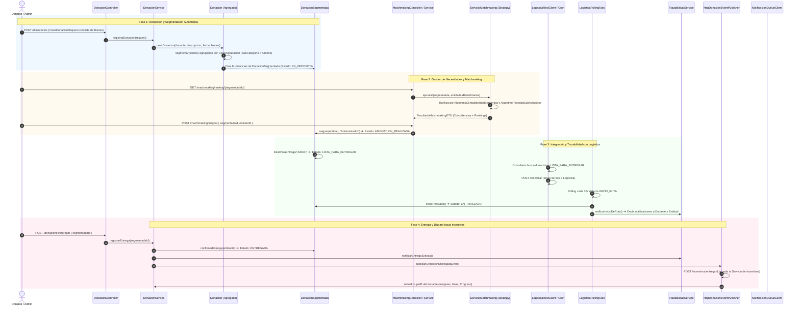
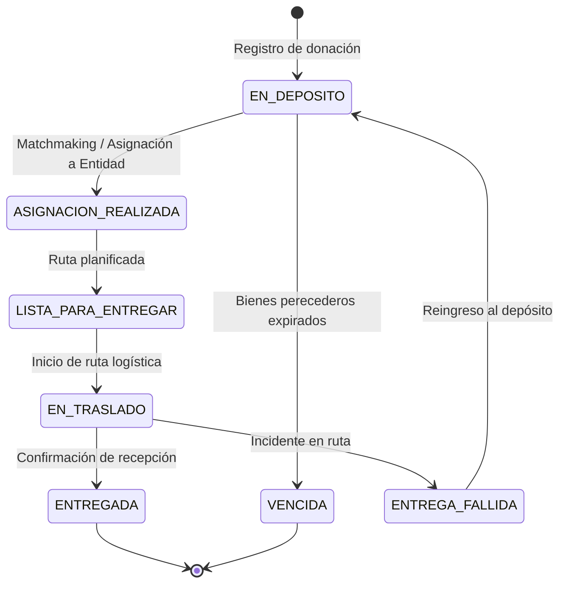
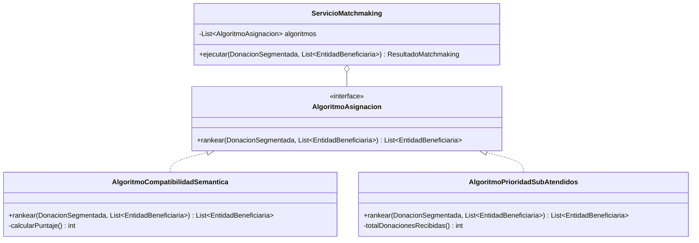

# 📦 Flujo Completo del Servicio de Donaciones (DonaTrack)

Este documento describe la arquitectura, ciclo de vida, modelos de dominio, algoritmos de asignación e integraciones del **Servicio de Donaciones**, el núcleo operativo (*Core Domain*) de DonaTrack.

---

## 🗺️ Diagrama General del Ciclo de Vida de una Donación



---

## 1. Recepción y Creación de la Donación

### 1.1. Entrada por el Controlador
El proceso inicia cuando un donante o administrador registra una nueva donación a través de [`DonacionController.java`](../servicio-donaciones/src/main/java/com/tp/donatrack/controllers/DonacionController.java#L65-L73):

```java
@PostMapping
public ResponseEntity<?> crearDonacion(@RequestBody com.tp.donatrack.dtos.CrearDonacionRequest request) {
    try {
        Donacion creada = donacionService.registrarDonacion(request);
        return ResponseEntity.status(HttpStatus.CREATED).body(creada);
    } catch (Exception e) {
        return ResponseEntity.badRequest().body("Error al crear donación: " + e.getMessage());
    }
}
```

### 1.2. Orquestación del Registro
En [`DonacionService.java`](../servicio-donaciones/src/main/java/com/tp/donatrack/services/DonacionService.java#L34-L48):
1. Se valida la existencia del donante en [`DonanteRepository.java`](../servicio-donaciones/src/main/java/com/tp/donatrack/repositories/DonanteRepository.java).
2. Se transforman los datos de entrada a entidades de dominio polimórficas de tipo [`Bien`](../servicio-donaciones/src/main/java/com/tp/donatrack/domain/bien/Bien.java) (`BienPerecedero` o `BienDuradero`).
3. Se instancia el agregado [`Donacion`](../servicio-donaciones/src/main/java/com/tp/donatrack/domain/donacion/Donacion.java).

```java
public Donacion registrarDonacion(CrearDonacionRequest request) {
    Donante donante = donanteService.buscarDonantePorId(request.getDonanteId());
    if (donante == null) {
        throw new IllegalArgumentException("No se encontró el donante con ID: " + request.getDonanteId());
    }

    List<com.tp.donatrack.domain.bien.Bien> bienes = request.toDomainBienes();
    Donacion donacion = new Donacion(
            donante,
            request.getDescripcion(),
            new java.util.Date(),
            bienes);

    return donacionRepository.save(donacion);
}
```

---

## 2. Segmentación Automática de Bienes

Una donación física puede incluir múltiples artículos heterogéneos (por ejemplo: 10 cajas de leche con fecha de vencimiento próxima, 5 paquetes de fideos y 2 camperas usadas). La donación debe **segmentarse automáticamente** para que cada grupo de bienes homogéneo pueda asignarse, trasladarse y entregarse de forma independiente.

### 2.1. Algoritmo de Segmentación en el Agregado
En [`Donacion.java`](../servicio-donaciones/src/main/java/com/tp/donatrack/domain/donacion/Donacion.java#L44-L56):

```java
private List<DonacionSegmentada> segmentar(List<Bien> bienes) {       
    Map<ClaveAgrupacion, List<Bien>> agrupados = bienes.stream()
        .collect(Collectors.groupingBy(Bien::getClaveAgrupacion));

    return agrupados.entrySet().stream()
        .map(entry -> new DonacionSegmentada(
            entry.getValue().size(), 
            entry.getKey().subCategoria(),
            entry.getValue(),
            this.donante != null ? this.donante.getPersona().getId() : null
        ))
        .collect(Collectors.toList());
}
```

### 2.2. Clave de Agrupación Polimórfica
La clave de agrupación se compone de la [`SubCategoria`](../servicio-donaciones/src/main/java/com/tp/donatrack/domain/bien/SubCategoria.java) y el criterio específico del tipo de bien:

* **[`ClaveAgrupacion.java`](../servicio-donaciones/src/main/java/com/tp/donatrack/domain/bien/ClaveAgrupacion.java#L4)**:
  ```java
  public record ClaveAgrupacion(SubCategoria subCategoria, Object criterio) {}
  ```

* **[`BienPerecedero.java`](../servicio-donaciones/src/main/java/com/tp/donatrack/domain/bien/BienPerecedero.java#L26-L28)**: Su criterio es la `fechaVencimiento`. Bienes con la misma subcategoría pero distinta fecha de vencimiento forman segmentos separados:
  ```java
  @Override
  public Object getCriterioSegmentacion() {
      return this.fechaVencimiento; 
  }
  ```

* **[`BienDuradero.java`](../servicio-donaciones/src/main/java/com/tp/donatrack/domain/bien/BienDuradero.java#L26-L28)**: Su criterio es el [`EstadoBien`](../servicio-donaciones/src/main/java/com/tp/donatrack/domain/bien/EstadoBien.java) (`NUEVO`, `USADO_BUENO`, `USADO_REGULAR`, etc.):
  ```java
  @Override
  public Object getCriterioSegmentacion() {
      return this.estado; 
  }
  ```

---

## 3. Máquina de Estados y Trazabilidad

DonaTrack maneja dos niveles de estados:

### 3.1. Estado General de la Donación (`EstadoDonacion`)
En [`EstadoDonacion.java`](../servicio-donaciones/src/main/java/com/tp/donatrack/domain/donacion/EstadoDonacion.java):
* `PENDIENTE`: Mientras al menos una de sus donaciones segmentadas no haya sido asignada.
* `ADJUDICADA`: Cuando **todos** sus segmentos pasaron a `ASIGNACION_REALIZADA`, `LISTA_PARA_ENTREGAR`, `EN_TRASLADO` o `ENTREGADA`.

Calculado dinámicamente en [`Donacion.java`](../servicio-donaciones/src/main/java/com/tp/donatrack/domain/donacion/Donacion.java#L58-L66):
```java
public EstadoDonacion getEstado() {
    boolean todasAsignadas = this.donacionesSegmentadas.stream()
            .allMatch(s -> s.getEstado() == EstadoDonacionSegmentada.ASIGNACION_REALIZADA
                    || s.getEstado() == EstadoDonacionSegmentada.LISTA_PARA_ENTREGAR
                    || s.getEstado() == EstadoDonacionSegmentada.EN_TRASLADO
                    || s.getEstado() == EstadoDonacionSegmentada.ENTREGADA); 
    
    return todasAsignadas ? EstadoDonacion.ADJUDICADA : EstadoDonacion.PENDIENTE;
}
```

### 3.2. Estados del Segmento (`EstadoDonacionSegmentada`)
En [`EstadoDonacionSegmentada.java`](../servicio-donaciones/src/main/java/com/tp/donatrack/domain/donacion/EstadoDonacionSegmentada.java):



### 3.3. Control de Transiciones e Historial de Trazabilidad
En [`DonacionSegmentada.java`](../servicio-donaciones/src/main/java/com/tp/donatrack/domain/donacion/DonacionSegmentada.java#L106-L125), cada transición valida las reglas de negocio y registra un [`EventoTrazabilidad`](../servicio-donaciones/src/main/java/com/tp/donatrack/domain/trazabilidad/EventoTrazabilidad.java):

```java
public boolean transicionPosible(EstadoDonacionSegmentada anterior, EstadoDonacionSegmentada nuevo) {
    return switch (anterior) {
        case EN_DEPOSITO ->
            nuevo == EstadoDonacionSegmentada.ASIGNACION_REALIZADA
                    || nuevo == EstadoDonacionSegmentada.VENCIDA;
        case ASIGNACION_REALIZADA -> nuevo == EstadoDonacionSegmentada.LISTA_PARA_ENTREGAR;
        case LISTA_PARA_ENTREGAR -> nuevo == EstadoDonacionSegmentada.EN_TRASLADO;
        case EN_TRASLADO ->
            nuevo == EstadoDonacionSegmentada.ENTREGADA
                    || nuevo == EstadoDonacionSegmentada.ENTREGA_FALLIDA;
        case ENTREGA_FALLIDA -> nuevo == EstadoDonacionSegmentada.EN_DEPOSITO;
        case ENTREGADA, VENCIDA -> false; // Estados finales
        default -> false;
    };
}
```

---

## 4. Gestión de Necesidades de Entidades Beneficiarias

Las entidades beneficiarias publican pedidos materiales para subsanar sus carencias.

### 4.1. Modelo de Jerarquía de Necesidades
* **[`NecesidadMaterial.java`](../servicio-donaciones/src/main/java/com/tp/donatrack/domain/necesidad/NecesidadMaterial.java)** (Clase Base):
  - Posee `cantidadObjetivo`, `cantidadRecibida` y [`EstadoNecesidad`](../servicio-donaciones/src/main/java/com/tp/donatrack/domain/necesidad/EstadoNecesidad.java) (`ACTIVO`, `SATISFECHO`, `INSATISFECHO`).
  - `cantidadFaltanteDelPedido()`: `Math.max(cantidadObjetivo - cantidadRecibida, 0)`.
  - Al recibir donaciones (`recibirDonacion(...)`), incrementa `cantidadRecibida` y pasa a `SATISFECHO` si la cantidad faltante llega a cero.

* **[`NecesidadRecurrente.java`](../servicio-donaciones/src/main/java/com/tp/donatrack/domain/necesidad/NecesidadRecurrente.java)**:
  - Tiene un periodo de vigencia en `dias`.
  - `enPeriodo()`: Si pasaron más días que los estipulados desde la fecha del pedido, se finaliza automáticamente como `INSATISFECHO`.

* **[`NecesidadExtraordinaria.java`](../servicio-donaciones/src/main/java/com/tp/donatrack/domain/necesidad/NecesidadExtraordinaria.java)**:
  - Creada para contingencias imprevistas (inundaciones, incendios, emergencias) asociadas a una `causa` puntual.

---

## 5. Algoritmos de Asignación y Matchmaking

El sistema implementa el patrón **Strategy** para determinar qué entidad beneficiaria tiene mayor prioridad para recibir una donación segmentada en depósito.



### 5.1. Algoritmo 1: Compatibilidad Semántica
En [`AlgoritmoCompatibilidadSemantica.java`](../servicio-donaciones/src/main/java/com/tp/donatrack/domain/asignacion/AlgoritmoCompatibilidadSemantica.java#L21-L45):
* Filtra entidades con necesidades activas cuya `SubCategoria` coincida con la de la donación.
* Ordena descendentemente según la **cantidad faltante** (`cantidadFaltanteDelPedido()`), priorizando a las entidades que tienen mayor urgencia/déficit.

```java
@Override
public List<EntidadBeneficiaria> rankear(DonacionSegmentada donacion, List<EntidadBeneficiaria> entidades) {
    return entidades.stream()
            .filter(e -> tieneNecesidadCompatible(e, donacion))
            .sorted(Comparator.comparingInt((EntidadBeneficiaria e) -> calcularPuntaje(e, donacion)).reversed())
            .limit(MAX_RESULTADOS)
            .collect(Collectors.toList());
}
```

### 5.2. Algoritmo 2: Prioridad a Organizaciones Sub-Atendidas
En [`AlgoritmoPrioridadSubAtendidos.java`](../servicio-donaciones/src/main/java/com/tp/donatrack/domain/asignacion/AlgoritmoPrioridadSubAtendidos.java#L20-L40):
* Filtra entidades que tengan al menos una necesidad activa.
* Ordena ascendentemente por el total de donaciones recibidas previamente (`totalDonacionesRecibidas()`), favoreciendo a las organizaciones que menos donaciones han recibido históricamente.

```java
@Override
public List<EntidadBeneficiaria> rankear(DonacionSegmentada donacion, List<EntidadBeneficiaria> entidades) {
    return entidades.stream()
            .filter(e -> tieneNecesidadActiva(e))
            .sorted(Comparator.comparingInt(this::totalDonacionesRecibidas))
            .limit(MAX_RESULTADOS)
            .collect(Collectors.toList());
}
```

### 5.3. Intersección y Selección de Coincidencias
En [`ServicioMatchmaking.java`](../servicio-donaciones/src/main/java/com/tp/donatrack/domain/asignacion/ServicioMatchmaking.java#L34-L47):
* Ejecuta ambos algoritmos concurrentemente.
* Obtiene las **coincidencias** (entidades recomendadas por ambas estrategias a la vez):

```java
public ResultadoMatchmaking ejecutar(DonacionSegmentada donacion, List<EntidadBeneficiaria> entidades) {
    if (donacion.getEstado() != EstadoDonacionSegmentada.EN_DEPOSITO) {
        throw new IllegalStateException("Solo se pueden asignar donaciones en estado EN_DEPOSITO");
    }

    List<EntidadBeneficiaria> resultadoCompatibilidad = algoritmos.get(0).rankear(donacion, entidades);
    List<EntidadBeneficiaria> resultadoSubAtendidos = algoritmos.get(1).rankear(donacion, entidades);

    List<EntidadBeneficiaria> coincidencias = resultadoCompatibilidad.stream()
            .filter(resultadoSubAtendidos::contains)
            .collect(Collectors.toList());

    return new ResultadoMatchmaking(coincidencias, resultadoCompatibilidad, resultadoSubAtendidos);
}
```

### 5.4. Confirmación de Asignación
El administrador selecciona una entidad del ranking mediante `POST /matchmaking/asignar` en [`MatchmakingController.java`](../servicio-donaciones/src/main/java/com/tp/donatrack/controllers/MatchmakingController.java), invocando [`MatchmakingService.java`](../servicio-donaciones/src/main/java/com/tp/donatrack/services/MatchmakingService.java#L85-L101):
```java
segmentada.asignar(entidad, "Administrador");
```
Esto transiciona el estado a `ASIGNACION_REALIZADA` y asocia la donación a la necesidad de la entidad.

---

## 6. Comunicación con el Servicio de Logística

La comunicación con Logística es bidireccional (envío de lotes + polling de estados):

### 6.1. Envío de Lotes para Planificación (Push vía Cron)
En [`DonacionesListasParaEntregarCron.java`](../servicio-donaciones/src/main/java/com/tp/donatrack/tasks/DonacionesListasParaEntregarCron.java#L38-L99):
1. Se buscan las donaciones en estado `LISTA_PARA_ENTREGAR`.
2. Se resuelve la dirección física de cada entidad beneficiaria.
3. Se invoca [`LogisticaRestClient.java`](../servicio-donaciones/src/main/java/com/tp/donatrack/clients/LogisticaRestClient.java#L21-L32) haciendo `POST /planificar` hacia el Servicio de Logística (puerto `8083`):

```java
public void enviarLoteDonaciones(List<DonacionSegmentadaListaParaEntregarALogisticaDTO> lote) {
    String url = UriComponentsBuilder.fromHttpUrl(logisticaUrl)
            .path("/planificar")
            .build()
            .toUriString();

    restTemplate.postForObject(url, lote, Void.class);
}
```

### 6.2. Sondeo de Eventos de Logística (Polling Task)
En [`LogisticaPollingTask.java`](../servicio-donaciones/src/main/java/com/tp/donatrack/services/LogisticaPollingTask.java#L52-L90), una tarea programada cada 10 segundos consulta `GET /api/logistica/rutas/eventos`:

* **Evento `INICIO_RUTA`**:
  - Transiciona la donación segmentada a `EN_TRASLADO`.
  - [`TrazabilidadService.notificarInicioDeRuta(...)`](../servicio-donaciones/src/main/java/com/tp/donatrack/services/TrazabilidadService.java#L186-L223) notifica por correo/WhatsApp al donante y a la entidad beneficiaria.

* **Evento `ENTREGA_FALLIDA`**:
  - Registra el motivo del fallo, transiciona a `ENTREGA_FALLIDA` y devuelve la donación a `EN_DEPOSITO`.
  - [`TrazabilidadService.notificarEntregaNoSatisfactoria(...)`](../servicio-donaciones/src/main/java/com/tp/donatrack/services/TrazabilidadService.java#L232-L269) notifica a las partes sobre el reintento.

---

## 7. Comunicación con el Servicio de Incentivos

Cuando la entidad beneficiaria recibe los bienes, se confirma la entrega final:

### 7.1. Publicación del Evento de Entrega
Al invocarse `POST /donaciones/entregar` en [`DonacionController.java`](../servicio-donaciones/src/main/java/com/tp/donatrack/controllers/DonacionController.java#L75-L83), [`DonacionService.java`](../servicio-donaciones/src/main/java/com/tp/donatrack/services/DonacionService.java#L76-L85) dispara el publicador:

```java
DonacionEntregadaEventDTO donacionEntregada = new DonacionEntregadaEventDTO();
donacionEntregada.setDonacionSegmentadaId(segmentada.getId());
donacionEntregada.setProgreso(donante.getPerfil().getProgreso());
donacionEntregada.setDonanteId(donante.getPersona().getId());
donacionEntregada.setUltimaMisionId(donante.getPerfil().getMisionActualId());
donacionEntregada.setCategoriaDonante(donante.getPerfil().getNivelDonante());
donacionEntregada.setNombreDonante(donante.getNombreCompleto());

eventPublisher.publicar(new DonacionEntregadaEvent(donacionEntregada));
```

[`HttpDonacionEventPublisher.java`](../servicio-donaciones/src/main/java/com/tp/donatrack/services/HttpDonacionEventPublisher.java#L52-L58) envía el `POST /incentivos/entrega`.

### 7.2. Exposición de Métricas bajo demanda (Pull de Incentivos)
[`DonacionSegmentadaController.java`](../servicio-donaciones/src/main/java/com/tp/donatrack/controllers/DonacionSegmentadaController.java#L29-L41) expone el endpoint:
```http
GET /donaciones-segmentadas/indicadores/{donacionSegmentadaId}?donanteId=1&indicadores=CANTIDAD_BIENES,MESES_CONSECUTIVOS,CATEGORIAS_DISTINTAS,ENTREGAS_EXITOSAS_TOTALES
```
Donde [`DonanteService.calcularIndicadores(...)`](../servicio-donaciones/src/main/java/com/tp/donatrack/services/DonanteService.java#L219-L248) calcula de forma eficiente los indicadores métricos para evaluar si el donante cumplió su misión.

### 7.3. Actualización de Datos del Donante
Al recibir la respuesta exitosa de Incentivos, [`HttpDonacionEventPublisher.java`](../servicio-donaciones/src/main/java/com/tp/donatrack/services/HttpDonacionEventPublisher.java#L71-L94) actualiza en [`PerfilDonante.java`](../servicio-donaciones/src/main/java/com/tp/donatrack/domain/donante/PerfilDonante.java):
* **Insignias Ganadas**: Agrega la nueva insignia obtenida al listado.
* **Misiones Cumplidas**: Registra el ID de la misión en las métricas históricas.
* **Nivel de Donante**: Asciende al donante si cambió de categoría (`COLABORADOR` ➔ `SOSTENEDOR` ➔ `TRANSFORMADOR`).
* **Progreso y Próxima Misión**: Actualiza el porcentaje y el nuevo `misionActualId`.

---

## 📊 Resumen de Endpoints Principales del Servicio

| Método | Endpoint | Controlador | Descripción |
| :--- | :--- | :--- | :--- |
| `POST` | `/donaciones` | [`DonacionController`](../servicio-donaciones/src/main/java/com/tp/donatrack/controllers/DonacionController.java) | Crea y segmenta una donación con sus bienes. |
| `POST` | `/donaciones/entregar` | [`DonacionController`](../servicio-donaciones/src/main/java/com/tp/donatrack/controllers/DonacionController.java) | Confirma la entrega y dispara evento a Incentivos. |
| `GET` | `/matchmaking/ranking/{id}` | [`MatchmakingController`](../servicio-donaciones/src/main/java/com/tp/donatrack/controllers/MatchmakingController.java) | Obtiene el ranking de entidades para una donación segmentada. |
| `POST` | `/matchmaking/asignar` | [`MatchmakingController`](../servicio-donaciones/src/main/java/com/tp/donatrack/controllers/MatchmakingController.java) | Asigna la donación en depósito a la entidad beneficiaria. |
| `GET` | `/trazabilidad/donaciones/{id}` | [`TrazabilidadController`](../servicio-donaciones/src/main/java/com/tp/donatrack/controllers/TrazabilidadController.java) | Consulta el historial de estados de todos los segmentos. |
| `GET` | `/donaciones-segmentadas/indicadores/{id}` | [`DonacionSegmentadaController`](../servicio-donaciones/src/main/java/com/tp/donatrack/controllers/DonacionSegmentadaController.java) | Endpoint consultado por Incentivos para evaluar misiones. |
| `POST` | `/necesidades` | [`NecesidadController`](../servicio-donaciones/src/main/java/com/tp/donatrack/controllers/NecesidadController.java) | Registra una nueva necesidad para una entidad beneficiaria. |
