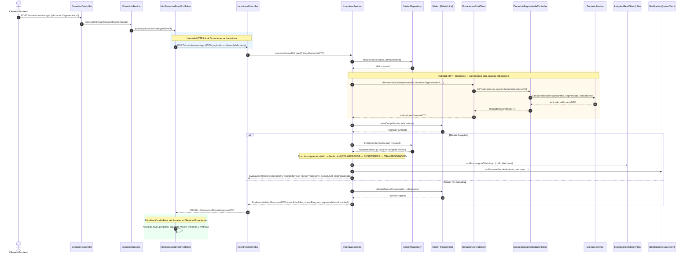

# 🔄 Flujo Completo de Integración: Donaciones e Incentivos

Este documento describe en detalle el ciclo de vida y la interacción completa entre el **Servicio de Donaciones** y el **Servicio de Incentivos** en DonaTrack, incluyendo código fuente exacto, llamados HTTP, evaluación de misiones, subida de niveles, emisión de insignias y actualización final del perfil del donante.

---

## 🗺️ Diagrama de Secuencia del Flujo



---

## 1. Disparo de la Entrega en el Servicio de Donaciones

### 1.1. Entrada por Controller
El flujo comienza cuando se solicita confirmar la entrega de una donación segmentada a través de [`DonacionController.java`](../servicio-donaciones/src/main/java/com/tp/donatrack/controllers/DonacionController.java#L75-L84):

```java
@PostMapping("/entregar")
public ResponseEntity<String> entregarDonacion(@RequestBody EntregaRequest request) {
    try {
        donacionService.registrarEntrega(request.getDonacionSegmentadaId());
        return ResponseEntity.ok("Donación segmentada entregada y evento de incentivos disparado.");
    } catch (Exception e) {
        return ResponseEntity.badRequest().body("Error: " + e.getMessage());
    }
}
```

---

### 1.2. Lógica de Negocio y Publicación del Evento
En [`DonacionService.java`](../servicio-donaciones/src/main/java/com/tp/donatrack/services/DonacionService.java#L54-L86), el método `registrarEntrega`:
1. Confirma el cambio de estado de la donación a `ENTREGADA`.
2. Actualiza el historial del donante en memoria.
3. Prepara el DTO del evento con los datos requeridos.
4. Invoca al publicador `eventPublisher.publicar(...)`.

```java
public void registrarEntrega(Long donacionSegmentadaId) {
    DonacionSegmentada segmentada = donacionRepository
            .findSegmentadaById(donacionSegmentadaId);

    if (segmentada == null) {
        throw new IllegalArgumentException("No se encontró la donación segmentada con ID: " + donacionSegmentadaId);
    }

    if (segmentada.getEntidadBeneficiariaAsignadaId() == null) {
        throw new IllegalStateException(
                "La donación segmentada no tiene una entidad beneficiaria asignada. Ejecute el matchmaking primero.");
    }

    Long donanteId = segmentada.getDonanteId();
    Donante donante = this.donanteService.buscarDonantePorId(donanteId);

    segmentada.confirmarEntrega(segmentada.getEntidadBeneficiariaAsignadaId());
    this.notificarEntrega(segmentada);

    this.donanteService.registrarEntregaEnPerfil(donanteId, segmentada);

    if (eventPublisher != null) {
        DonacionEntregadaEventDTO donacionEntregada = new DonacionEntregadaEventDTO();
        donacionEntregada.setDonacionSegmentadaId(segmentada.getId());
        donacionEntregada.setProgreso(donante.getPerfil().getProgreso());
        donacionEntregada.setDonanteId(donante.getPersona().getId());
        donacionEntregada.setUltimaMisionId(donante.getPerfil().getMisionActualId());
        donacionEntregada.setCategoriaDonante(donante.getPerfil().getNivelDonante());
        donacionEntregada.setNombreDonante(donante.getNombreCompleto());
        
        eventPublisher.publicar(new DonacionEntregadaEvent(donacionEntregada));
    }
}
```

---

## 2. Primera Llamada HTTP: Donaciones ➔ Incentivos

En [`HttpDonacionEventPublisher.java`](../servicio-donaciones/src/main/java/com/tp/donatrack/services/HttpDonacionEventPublisher.java#L39-L59), se envía la petición HTTP POST al endpoint `/incentivos/entrega` (puerto `8081`):

```java
@Override
public void publicar(DonacionEntregadaEvent event) {
    Map<String, Object> requestBody = new HashMap<>();
    requestBody.put("donacionSegmentadaId", event.dto().getDonacionSegmentadaId());
    requestBody.put("donanteId", event.dto().getDonanteId());
    requestBody.put("ultimaMisionId", event.dto().getUltimaMisionId());
    requestBody.put("progreso", event.dto().getProgreso());
    requestBody.put("categoriaDonante", event.dto().getCategoriaDonante());
    requestBody.put("nombreDonante", event.dto().getNombreDonante());

    try {
        logger.debug("Enviando request a Incentivos: {}", requestBody);

        String url = incentivosUrl + "/entrega";

        var responseEntity = restTemplate.postForEntity(
                url,
                requestBody,
                EvaluacionMisionResponseDTO.class);
        // ...
```

### 📦 Atributos enviados en el Payload:
| Atributo | Tipo | Descripción |
| :--- | :--- | :--- |
| `donacionSegmentadaId` | `Long` | ID de la donación segmentada entregada |
| `donanteId` | `Long` | ID único de la persona donante |
| `ultimaMisionId` | `Long` | ID de la misión actual que tiene asignada el donante |
| `progreso` | `Double` | Progreso acumulado en la misión actual (0.0 a 100.0) |
| `categoriaDonante` | `Nivel` | Nivel actual (`COLABORADOR`, `SOSTENEDOR`, `TRANSFORMADOR`) |
| `nombreDonante` | `String` | Nombre completo del donante para emitir las insignias |

---

## 3. Procesamiento en el Servicio de Incentivos

### 3.1. Recepción en el Controlador
En [`IncentivosController.java`](../servicio-incentivos/src/main/java/com/tp/incentivos/controllers/IncentivosController.java#L37-L41):

```java
@PostMapping("/entrega")
public ResponseEntity<EvaluacionMisionResponseDTO> procesarEntrega(@Valid @RequestBody EntregaDonacionDTO dto) {
    EvaluacionMisionResponseDTO resultado = service.procesarNuevaEntrega(dto);
    return ResponseEntity.ok(resultado);
}
```

---

### 3.2. Búsqueda de la Misión y Callback para Obtener Indicadores
En [`IncentivosService.java`](../servicio-incentivos/src/main/java/com/tp/incentivos/services/IncentivosService.java#L42-L69):

1. Se resuelve el nivel y la misión que el donante está intentando cumplir usando [`MisionRepository.java`](../servicio-incentivos/src/main/java/com/tp/incentivos/repositories/MisionRepository.java#L107-L112).
2. **Incentivos llama de vuelta a Donaciones** mediante [`DonacionesRestClient.java`](../servicio-incentivos/src/main/java/com/tp/incentivos/clients/DonacionesRestClient.java#L21-L34) al endpoint `/donaciones-segmentadas/indicadores/{donacionSegmentadaId}` para calcular métricas actualizadas en tiempo real:
   - `CANTIDAD_BIENES`: Total de bienes de la donación actual.
   - `MESES_CONSECUTIVOS`: Racha de meses donando.
   - `CATEGORIAS_DISTINTAS`: Cantidad de categorías distintas en las que ha donado.
   - `ENTREGAS_EXITOSAS_TOTALES`: Donaciones totales entregadas a entidades.

```java
public EvaluacionMisionResponseDTO procesarNuevaEntrega(EntregaDonacionDTO dto) {
    Nivel nivelActual = dto.getCategoriaDonante() != null ? dto.getCategoriaDonante() : Nivel.COLABORADOR;
    Long ultimaMisionId = (dto.getUltimaMisionId() == null) ? obtenerMisionInicialId() : dto.getUltimaMisionId();

    Mision misionActual = this.misionRepository.findById(nivelActual, ultimaMisionId)
            .orElseThrow(() -> new RuntimeException("Misión no encontrada con ID: " + ultimaMisionId));

    IndicadoresDonanteDTO indicadores = this.donacionesRestClient.obtenerIndicadores(
            dto.getDonanteId(),
            dto.getDonacionSegmentadaId(),
            List.of(
                    "CANTIDAD_BIENES",
                    "MESES_CONSECUTIVOS",
                    "CATEGORIAS_DISTINTAS",
                    "ENTREGAS_EXITOSAS_TOTALES"));

    boolean cumplida = misionActual.estaCumplida(dto, indicadores);
```

---

## 4. Validación de Misiones y Subida de Nivel

### 4.1. Misiones Polimórficas
Cada misión hereda de [`Mision.java`](../servicio-incentivos/src/main/java/com/tp/incentivos/domain/misiones/Mision.java#L11-L23) e implementa su propia condición:

* **[`MisionDonacionesExitosas.java`](../servicio-incentivos/src/main/java/com/tp/incentivos/domain/misiones/MisionDonacionesExitosas.java#L28-L30)**:
  ```java
  public boolean estaCumplida(EntregaDonacionDTO datos, IndicadoresDonanteDTO metricas) {
      return metricas.getCantidadDonacionesEntregadas() >= this.objetivo;
  }
  ```
* **[`MisionCompletitud.java`](../servicio-incentivos/src/main/java/com/tp/incentivos/domain/misiones/MisionCompletitud.java#L34-L36)**:
  ```java
  public boolean estaCumplida(EntregaDonacionDTO dto, IndicadoresDonanteDTO metricas) {
      return metricas.getCantidadCategoriasUnicas() >= this.objetivo;
  }
  ```
* **[`MisionHabilDonador.java`](../servicio-incentivos/src/main/java/com/tp/incentivos/domain/misiones/MisionHabilDonador.java#L25-L27)**:
  ```java
  public boolean estaCumplida(EntregaDonacionDTO dto, IndicadoresDonanteDTO metricas) {
      return metricas.getCantidadBienesTotal() >= this.objetivo;
  }
  ```
* **[`MisionRacha.java`](../servicio-incentivos/src/main/java/com/tp/incentivos/domain/misiones/MisionRacha.java#L28-L30)**:
  ```java
  public boolean estaCumplida(EntregaDonacionDTO dto, IndicadoresDonanteDTO indicadores) {
      return indicadores.getMesesConsecutivosRacha() >= this.objetivo;
  }
  ```

---

### 4.2. Lógica de Avance y Subida de Nivel
En [`IncentivosService.java`](../servicio-incentivos/src/main/java/com/tp/incentivos/services/IncentivosService.java#L70-L125):

```java
if (cumplida) {
    Optional<Mision> siguienteMision = this.misionRepository.findSiguiente(nivelActual, ultimaMisionId);
    Long siguienteMisionId = siguienteMision.map(Mision::getId).orElse(null);

    boolean subioDeCategoria = false;
    Nivel nuevoNivel = nivelActual;

    if (siguienteMisionId == null) {
        // Completó todas las misiones de su nivel actual, sube al siguiente nivel
        if (nivelActual == Nivel.COLABORADOR) {
            nuevoNivel = Nivel.SOSTENEDOR;
            siguienteMisionId = obtenerMisionInicialId();
            subioDeCategoria = true;
        } else if (nivelActual == Nivel.SOSTENEDOR) {
            nuevoNivel = Nivel.TRANSFORMADOR;
            siguienteMisionId = obtenerMisionInicialId();
            subioDeCategoria = true;
        }
    }

    // Notificación externa de insignia generada (webhook n8n)
    this.insigniasRestClient.notificarInsigniaObtenida(
            dto.getNombreDonante(),
            misionActual.getTitulo(),
            misionActual.getDescripcion());

    // Notificación al usuario por cola/email/whatsapp
    this.notificarMisionCumplida(dto.getDonanteId(), misionActual.getTitulo());

    if (subioDeCategoria) {
        this.notificarSubidaNivel(dto.getDonanteId(), nuevoNivel);
    }

    return EvaluacionMisionResponseDTO.builder()
            .misionCumplida(true)
            .nuevoProgreso(0.0)
            .insigniaGanada(misionActual.getInsigniaAsociada())
            .siguienteMisionId(siguienteMisionId)
            .subioDeCategoria(subioDeCategoria)
            .nuevoNivel(nuevoNivel)
            .build();
}

// Si no se cumplió la misión, calculamos el porcentaje de progreso parcial
double progresoActualizado = misionActual.calcularNuevoProgreso(dto, indicadores);

return EvaluacionMisionResponseDTO.builder()
        .misionCumplida(false)
        .nuevoProgreso(progresoActualizado)
        .insigniaGanada(null)
        .siguienteMisionId(ultimaMisionId)
        .build();
```

---

## 5. Actualización del Donante en el Servicio de Donaciones

De regreso en [`HttpDonacionEventPublisher.java`](../servicio-donaciones/src/main/java/com/tp/donatrack/services/HttpDonacionEventPublisher.java#L59-L99), al recibir el `200 OK` con el `EvaluacionMisionResponseDTO`, se sincronizan los cambios en la entidad [`PerfilDonante.java`](../servicio-donaciones/src/main/java/com/tp/donatrack/domain/donante/PerfilDonante.java#L18-L47):

```java
if (responseEntity.getStatusCode().is2xxSuccessful() && responseEntity.getBody() != null) {
    EvaluacionMisionResponseDTO response = responseEntity.getBody();

    Donante donante = donanteRepository.findById(event.dto().getDonanteId());

    if (donante == null) {
        logger.error("Error: Donante con ID {} no encontrado en memoria.", event.dto().getDonanteId());
        return;
    }

    // 1. Agregar insignia al listado de insignias ganadas
    if (response.getInsigniaGanada() != null) {
        logger.info("Donante ganó insignia: {}", response.getInsigniaGanada().getTitulo());
        donante.getPerfil().getInsigniasGanadas().add(response.getInsigniaGanada().getTitulo());
    }

    // 2. Registrar misión completada en las métricas del perfil
    if (response.isMisionCumplida()) {
        Metrica metricaDonante = donante.getPerfil().getMetricasPerfil();
        metricaDonante.getMisionesCompletadas().add(donante.getPerfil().getMisionActualId());
    }

    // 3. Si ascendió de categoría, actualizar su nivel
    if (response.isSubioDeCategoria() && response.getNuevoNivel() != null) {
        logger.info("Donante subió de nivel: {}", response.getNuevoNivel());
        donante.getPerfil().setNivelDonante(response.getNuevoNivel());
    }

    // 4. Actualizar nuevo progreso y el ID de la siguiente misión asignada
    donante.getPerfil().setProgreso(response.getNuevoProgreso());
    donante.getPerfil().setMisionActualId(response.getSiguienteMisionId());

    // 5. Persistir en el repositorio
    this.donanteRepository.update(donante);
    logger.info("Donante ID {} actualizado correctamente en memoria.", donante.getPersona().getId());
}
```

---

## 📊 Resumen de DTOs Involucrados

| DTO | Origen ➔ Destino | Propósito |
| :--- | :--- | :--- |
| [`EntregaDonacionDTO`](../servicio-incentivos/src/main/java/com/tp/incentivos/dtos/EntregaDonacionDTO.java) | Donaciones ➔ Incentivos | Informa los datos de la donación entregada y estado actual del donante. |
| [`IndicadoresDonanteDTO`](../commons/src/main/java/com/tp/commons/dtos/incentivos/IndicadoresDonanteDTO.java) | Donaciones ➔ Incentivos | Contiene los cálculos métricos (rachas, categorías, donaciones exitosas). |
| [`EvaluacionMisionResponseDTO`](../commons/src/main/java/com/tp/commons/dtos/incentivos/EvaluacionMisionResponseDTO.java) | Incentivos ➔ Donaciones | Resultado final con progreso, si cumplió la misión, nueva insignia y nuevo nivel. |
