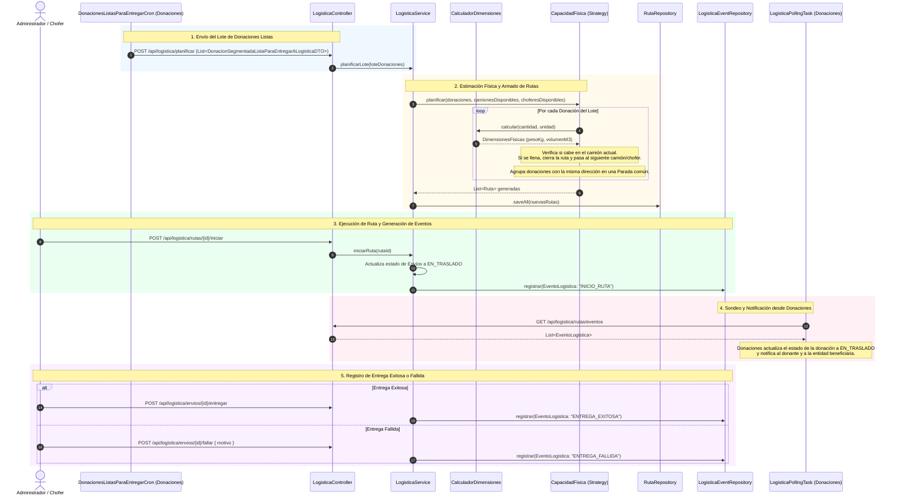
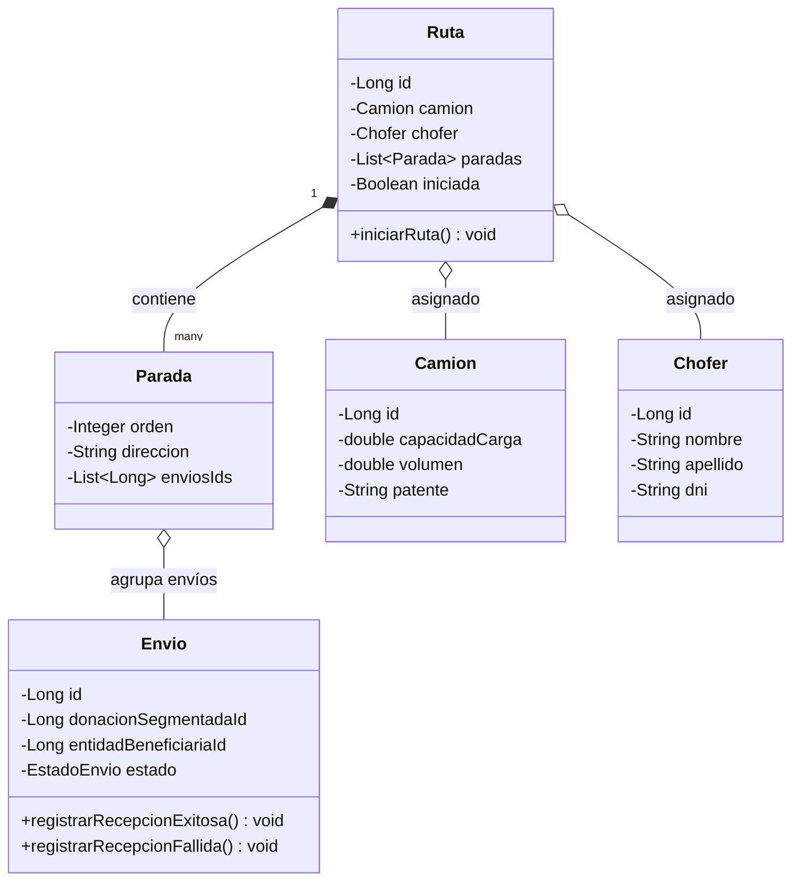

# 🚚 Flujo Completo del Servicio de Logística (DonaTrack)

Este documento describe la arquitectura, modelos de dominio, cálculo de dimensiones físicas (peso y cubicaje), algoritmos de planificación de rutas, gestión de flota (camiones y choferes) y el sistema de eventos del **Servicio de Logística**.

---

## 🗺️ Diagrama General del Flujo de Logística



---

## 1. Entrada de Datos: Cuándo y Cómo se invoca

El Servicio de Logística opera desacoplado del Servicio de Donaciones. No conoce a los donantes ni las subcategorías internas; únicamente procesa **Envíos**, **Paradas**, **Camiones** y **Rutas**.

### 1.1. Invocación desde Donaciones
El proceso de planificación se dispara de manera automatizada mediante una tarea programada en [`DonacionesListasParaEntregarCron.java`](../servicio-donaciones/src/main/java/com/tp/donatrack/tasks/DonacionesListasParaEntregarCron.java#L38-L99) en el Servicio de Donaciones, que recolecta todas las donaciones en estado `LISTA_PARA_ENTREGAR` y las envía al endpoint de Logística:

* **Endpoint**: `POST /api/logistica/planificar` en [`LogisticaController.java`](../servicio-logistica/src/main/java/com/tp/donatrack/logistica/controllers/LogisticaController.java#L50-L56)
* **Código en el Controlador**:
  ```java
  @PostMapping("/planificar")
  public ResponseEntity<Void> planificarRutas(
          @RequestBody List<DonacionSegmentadaListaParaEntregarALogisticaDTO> loteDonaciones
  ) {
      logisticaService.planificarLote(loteDonaciones);
      return ResponseEntity.ok().build();
  }
  ```

### 1.2. Estructura del Payload Recibido (`DTO`)
Cada elemento de la lista contiene la información mínima indispensable para que Logística opere:

```java
public record DonacionSegmentadaListaParaEntregarALogisticaDTO(
    Long donacionSegmentadaId,
    Long entidadBeneficiariaId,
    String direccionEntidadBeneficiaria,
    Integer cantidad,
    Unidad unidad // KG, LITROS, METROS, UNIDADES
) {}
```

| Atributo | Tipo | Descripción |
| :--- | :--- | :--- |
| `donacionSegmentadaId` | `Long` | Identificador de la donación segmentada en Donaciones. |
| `entidadBeneficiariaId` | `Long` | Identificador de la entidad destino. |
| `direccionEntidadBeneficiaria` | `String` | Dirección física de entrega (calle, altura, localidad). |
| `cantidad` | `Integer` | Magnitud numérica del lote donado (ej: 300, 50, 10). |
| `unidad` | `Unidad` | Unidad de medida (`KG`, `LITROS`, `METROS`, `UNIDADES`). |

---

## 2. Cálculo de Dimensiones Físicas (Peso y Cubicaje)

Para que el sistema determine si una donación cabe o no en un camión, el componente [`CalculadorDimensiones.java`](../servicio-logistica/src/main/java/com/tp/donatrack/logistica/domain/planificacion/CalculadorDimensiones.java#L7-L29) estima el **peso en kilogramos** y el **volumen en metros cúbicos ($m^3$)**:

### 2.1. Lógica de Conversión por Unidad de Medida
```java
@Component
public class CalculadorDimensiones {
    private static final double PESO_POR_UNIDAD_KG = 5.0;
    private static final double VOLUMEN_POR_UNIDAD_M3 = 0.5;

    public DimensionesFisicas calcular(Integer cantidad, Unidad unidad) {
        if (cantidad == null || cantidad <= 0) {
            return new DimensionesFisicas(0, 0);
        }

        if (unidad == null) {
            return new DimensionesFisicas(cantidad * PESO_POR_UNIDAD_KG, cantidad * VOLUMEN_POR_UNIDAD_M3);
        }

        return switch (unidad) {
            case KG -> new DimensionesFisicas(cantidad, cantidad * 0.002);
            case LITROS -> new DimensionesFisicas(cantidad, cantidad * 0.001);
            case METROS -> new DimensionesFisicas(cantidad * 2.0, cantidad * 0.1);
            case UNIDADES -> new DimensionesFisicas(cantidad * PESO_POR_UNIDAD_KG, cantidad * VOLUMEN_POR_UNIDAD_M3);
        };
    }
}
```

### 2.2. Factores de Conversión Utilizados:
* **`KG`**: Peso = $N\text{ kg}$, Volumen estimado = $N \times 0.002\text{ m}^3$ (densidad aprox. $500\text{ kg/m}^3$).
* **`LITROS`**: Peso = $N\text{ kg}$ (base agua), Volumen estimado = $N \times 0.001\text{ m}^3$ ($1\text{ L} = 0.001\text{ m}^3$).
* **`METROS`**: Peso estimado = $N \times 2.0\text{ kg}$, Volumen = $N \times 0.1\text{ m}^3$.
* **`UNIDADES` / Genérico**: Peso estimado = $N \times 5.0\text{ kg}$, Volumen = $N \times 0.5\text{ m}^3$.

El resultado se encapsula en el record [`DimensionesFisicas.java`](../servicio-logistica/src/main/java/com/tp/donatrack/logistica/domain/planificacion/DimensionesFisicas.java):
```java
public record DimensionesFisicas(double pesoKg, double volumenM3) {}
```

---

## 3. Gestión de la Flota (Camiones y Choferes)

### 3.1. Modelo del Camión
En [`Camion.java`](../servicio-logistica/src/main/java/com/tp/donatrack/logistica/domain/Camion.java#L14-L22), cada vehículo cuenta con restricciones físicas de capacidad:
```java
public class Camion {
    private Long id;
    private double volumen;        // Volumen máximo en m³
    private double altura;         // Altura máxima del furgón
    private String patente;        // Identificador del dominio
    private String marca;
    private String modelo;
    private double capacidadCarga; // Peso máximo en kg
}
```

### 3.2. Modelo del Chofer
En [`Chofer.java`](../servicio-logistica/src/main/java/com/tp/donatrack/logistica/domain/Chofer.java#L14-L19):
```java
public class Chofer {
    private Long id;
    private String nombre;
    private String apellido;
    private String dni;
}
```

### 3.3. Administración en Memoria / Repositorio
[`LogisticaService.java`](../servicio-logistica/src/main/java/com/tp/donatrack/logistica/services/LogisticaService.java#L51-L90) administra los camiones y choferes disponibles usando mapas concurrentes thread-safe (`ConcurrentHashMap`) con secuencias atómicas para generación de IDs:
* `registrarCamion(Camion camion)` ➔ `POST /api/logistica/camiones`
* `registrarChofer(Chofer chofer)` ➔ `POST /api/logistica/choferes`

---

## 4. Algoritmo de Planificación de Rutas (`CapacidadFisica`)

El proceso de armado de rutas utiliza el patrón **Strategy** a través de la interfaz [`Planificacion.java`](../servicio-logistica/src/main/java/com/tp/donatrack/logistica/domain/planificacion/Planificacion.java):

```java
public interface Planificacion {
    List<Ruta> planificar(
        List<DonacionSegmentadaListaParaEntregarALogisticaDTO> donaciones,
        List<Camion> camionesDisponibles,
        List<Chofer> choferesDisponibles
    );
}
```

### 4.1. Lógica del Algoritmo en [`CapacidadFisica.java`](../servicio-logistica/src/main/java/com/tp/donatrack/logistica/domain/planificacion/CapacidadFisica.java#L27-L100):

1. **Filtro de Excesos Absolutos**: Si una donación individual supera la capacidad máxima de cualquier camión de la flota, se emite un error y se deja en depósito para fraccionamiento posterior.
2. **Llenado Greedy por Capacidad**:
   - Se toma el primer camión y chofer disponible.
   - Se van sumando el peso y volumen acumulados.
   - Si al agregar la siguiente donación se supera `camion.getCapacidadCarga()` o `camion.getVolumen()`, **se cierra la ruta actual** y se asigna el siguiente camión y chofer de la lista.
   - Si se acaban los vehículos o choferes, lanza `IllegalStateException("Capacidad de flota superada")`.
3. **Agrupación de Paradas por Dirección**:
   - Donaciones que van a la **misma dirección** se agrupan automáticamente dentro de una misma [`Parada`](../servicio-logistica/src/main/java/com/tp/donatrack/logistica/domain/Parada.java), asignándoles un orden secuencial (1, 2, 3...).

```java
for (DonacionSegmentadaListaParaEntregarALogisticaDTO donacion : donaciones) {
    DimensionesFisicas dimensiones = calculadorDimensiones.calcular(donacion.cantidad(), donacion.unidad());

    if (dimensiones.pesoKg() > maxPesoFlota || dimensiones.volumenM3() > maxVolumenFlota) {
        log.error("La donación ID {} excede la capacidad máxima. Se dejará en el depósito.", donacion.donacionSegmentadaId());
        continue;
    }

    // Si supera el peso o volumen del camión actual, cerramos la ruta y pasamos al siguiente
    if (pesoAcumulado + dimensiones.pesoKg() > camionActual.getCapacidadCarga() ||
        volumenAcumulado + dimensiones.volumenM3() > camionActual.getVolumen()) {
        
        rutasGeneradas.add(construirRuta(camionActual, choferActual, enviosPorDireccionActual));

        indiceCamion++;
        indiceChofer++;

        if (indiceCamion >= camionesDisponibles.size() || indiceChofer >= choferesDisponibles.size()) {
            throw new IllegalStateException("Capacidad de flota superada. Faltan camiones o choferes.");
        }

        camionActual = camionesDisponibles.get(indiceCamion);
        choferActual = choferesDisponibles.get(indiceChofer);

        pesoAcumulado = 0.0;
        volumenAcumulado = 0.0;
        enviosPorDireccionActual = new HashMap<>();
    }

    pesoAcumulado += dimensiones.pesoKg();
    volumenAcumulado += dimensiones.volumenM3();

    // Agrupa donaciones por dirección física
    enviosPorDireccionActual
            .computeIfAbsent(donacion.direccionEntidadBeneficiaria(), k -> new ArrayList<>())
            .add(donacion.donacionSegmentadaId());
}
```

---

## 5. Estructura de Rutas, Paradas y Envíos

El modelo de dominio de Logística se organiza en torno a tres entidades principales:



* **[`Ruta.java`](../servicio-logistica/src/main/java/com/tp/donatrack/logistica/domain/Ruta.java)**: Representa el viaje completo de un camión con su chofer asignado y la lista ordenada de paradas.
* **[`Parada.java`](../servicio-logistica/src/main/java/com/tp/donatrack/logistica/domain/Parada.java)**: Representa un punto geográfico de entrega (`direccion`) y contiene los IDs de todos los envíos a descargar en ese lugar.
* **[`Envio.java`](../servicio-logistica/src/main/java/com/tp/donatrack/logistica/domain/Envio.java)**: Mantiene la correspondencia con la `donacionSegmentadaId` y su [`EstadoEnvio`](../servicio-logistica/src/main/java/com/tp/donatrack/logistica/domain/EstadoEnvio.java) (`PENDIENTE`, `ASIGNACION_REALIZADA`, `EN_TRASLADO`, `ENTREGADA`, `NO_RECIBIDA`).

---

## 6. Ciclo de Ejecución de Rutas y Emisión de Eventos

Durante la distribución física, el chofer o administrador interactúa con la API para registrar el progreso:

### 6.1. Inicio del Recorrido
* **Endpoint**: `POST /api/logistica/rutas/{id}/iniciar` en [`LogisticaService.java`](../servicio-logistica/src/main/java/com/tp/donatrack/logistica/services/LogisticaService.java#L119-L159).
* Marca `ruta.iniciarRuta()`.
* Transiciona los envíos a `EstadoEnvio.EN_TRASLADO`.
* Registra en [`LogisticaEventRepository.java`](../servicio-logistica/src/main/java/com/tp/donatrack/logistica/repository/LogisticaEventRepository.java) un evento:
  ```java
  EventoLogistica evento = EventoLogistica.builder()
          .tipoEvento("INICIO_RUTA")
          .donacionSegmentadaId(envio.getDonacionSegmentadaId())
          .entidadBeneficiariaId(envio.getEntidadBeneficiariaId())
          .timestamp(LocalDateTime.now())
          .detalles("Patente del camión: " + patente + ", Chofer ID: " + ruta.getChofer().getId())
          .build();
  ```

### 6.2. Registro de Entrega Exitosa
* **Endpoint**: `POST /api/logistica/envios/{id}/entregar` en [`LogisticaService.java`](../servicio-logistica/src/main/java/com/tp/donatrack/logistica/services/LogisticaService.java#L161-L178).
* Transiciona el envío a `EstadoEnvio.ENTREGADA`.
* Emite el evento `"ENTREGA_EXITOSA"`.

### 6.3. Registro de Entrega Fallida
* **Endpoint**: `POST /api/logistica/envios/{id}/fallar` en [`LogisticaService.java`](../servicio-logistica/src/main/java/com/tp/donatrack/logistica/services/LogisticaService.java#L180-L197).
* Transiciona el envío a `EstadoEnvio.NO_RECIBIDA`.
* Emite el evento `"ENTREGA_FALLIDA"` con el motivo reportado por el chofer (ej. "Entidad cerrada", "Dirección inaccesible").

---

## 7. Integración por Polling con el Servicio de Donaciones

Para evitar acoplamiento directo punto a punto o dependencias circulares, el Servicio de Donaciones no recibe llamadas directas de Logística. En su lugar:

1. Logística expone los eventos ocurridos a través de [`LogisticaEventController.java`](../servicio-logistica/src/main/java/com/tp/donatrack/logistica/controllers/LogisticaEventController.java#L13-L26):
   ```http
   GET /api/logistica/rutas/eventos
   ```
2. [`LogisticaPollingTask.java`](../servicio-donaciones/src/main/java/com/tp/donatrack/services/LogisticaPollingTask.java#L52-L90) en Donaciones consulta este endpoint cada 10 segundos:
   - Al detectar `INICIO_RUTA`: Actualiza la donación segmentada a `EN_TRASLADO` y notifica al donante y al beneficiario.
   - Al detectar `ENTREGA_FALLIDA`: Actualiza a `ENTREGA_FALLIDA`, reingresa los bienes a `EN_DEPOSITO` y notifica a las partes.

---

## 📊 Resumen de Endpoints del Servicio de Logística

| Método | Endpoint | Controlador | Descripción |
| :--- | :--- | :--- | :--- |
| `POST` | `/api/logistica/camiones` | [`LogisticaController`](../servicio-logistica/src/main/java/com/tp/donatrack/logistica/controllers/LogisticaController.java) | Registra un nuevo camión con su capacidad en kg y volumen. |
| `GET` | `/api/logistica/camiones` | [`LogisticaController`](../servicio-logistica/src/main/java/com/tp/donatrack/logistica/controllers/LogisticaController.java) | Lista todos los camiones de la flota. |
| `POST` | `/api/logistica/choferes` | [`LogisticaController`](../servicio-logistica/src/main/java/com/tp/donatrack/logistica/controllers/LogisticaController.java) | Registra un nuevo chofer habilitado. |
| `GET` | `/api/logistica/choferes` | [`LogisticaController`](../servicio-logistica/src/main/java/com/tp/donatrack/logistica/controllers/LogisticaController.java) | Lista todos los choferes registrados. |
| `POST` | `/api/logistica/planificar` | [`LogisticaController`](../servicio-logistica/src/main/java/com/tp/donatrack/logistica/controllers/LogisticaController.java) | Recibe el lote de donaciones y genera las rutas automáticas. |
| `GET` | `/api/logistica/rutas` | [`LogisticaController`](../servicio-logistica/src/main/java/com/tp/donatrack/logistica/controllers/LogisticaController.java) | Consulta todas las rutas planificadas con sus paradas. |
| `POST` | `/api/logistica/rutas/{id}/iniciar` | [`LogisticaController`](../servicio-logistica/src/main/java/com/tp/donatrack/logistica/controllers/LogisticaController.java) | Inicia el recorrido de un camión y genera evento `INICIO_RUTA`. |
| `POST` | `/api/logistica/envios/{id}/entregar` | [`LogisticaController`](../servicio-logistica/src/main/java/com/tp/donatrack/logistica/controllers/LogisticaController.java) | Registra la entrega exitosa de un envío. |
| `POST` | `/api/logistica/envios/{id}/fallar` | [`LogisticaController`](../servicio-logistica/src/main/java/com/tp/donatrack/logistica/controllers/LogisticaController.java) | Registra la falla en la entrega con su motivo. |
| `GET` | `/api/logistica/rutas/eventos` | [`LogisticaEventController`](../servicio-logistica/src/main/java/com/tp/donatrack/logistica/controllers/LogisticaEventController.java) | Endpoint consultado por Donaciones (polling) para sincronizar eventos. |
