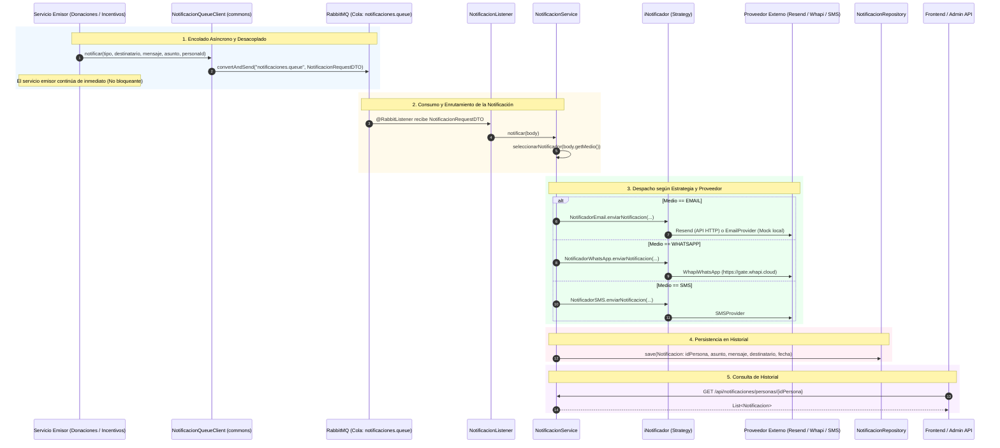
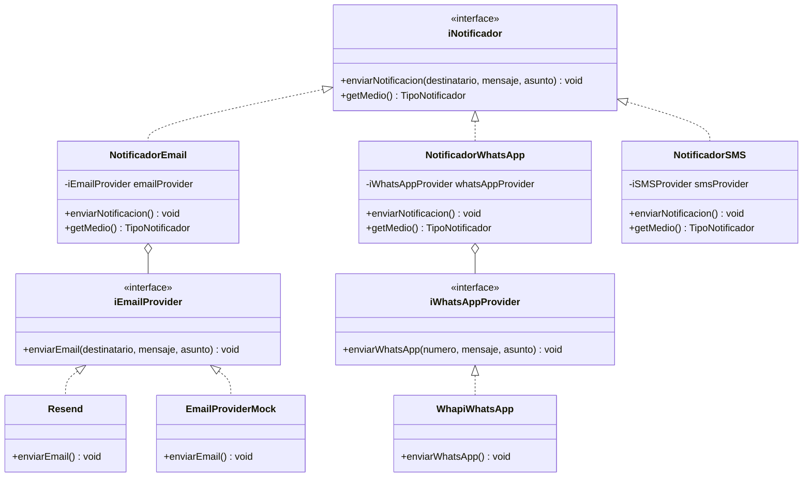

# 🔔 Flujo Completo del Servicio de Notificaciones (DonaTrack)

Este documento describe la arquitectura, integración asíncrona mediante colas de mensajería (RabbitMQ), patrones de diseño aplicados (Strategy / Bridge) y el catálogo de eventos que disparan notificaciones hacia donantes y entidades beneficiarias en DonaTrack.

---

## 🗺️ Diagrama General del Flujo de Notificaciones



---

## 1. ¿Cómo Funciona y Cuándo se Invoca?

El Servicio de Notificaciones es un **microservicio de infraestructura y comunicación** (puerto `8082`). Se encarga de enviar mensajes informativos y de gamificación a través del canal de preferencia del usuario (**Email**, **WhatsApp** o **SMS**) y registrar un historial auditable.

### 1.1. Invocación Asíncrona mediante RabbitMQ
Para garantizar que una demora o caída en las APIs de mensajería externas (ej: latencia en WhatsApp o Resend) **no bloquee ni aborte** las transacciones principales de donaciones o incentivos, la comunicación se realiza a través de **RabbitMQ**:

En [`NotificacionQueueClient.java`](../commons/src/main/java/com/tp/commons/services/notificador/NotificacionQueueClient.java#L21-L44):
```java
public boolean notificar(
        TipoNotificador tipo,
        String destinatario,
        String mensaje,
        String asunto,
        Long personaId
) {
    NotificacionRequestDTO dto = new NotificacionRequestDTO();
    dto.setMedio(tipo);
    dto.setDestinatario(destinatario);
    dto.setMensaje(mensaje);
    dto.setAsunto(asunto);
    dto.setIdPersona(personaId);

    try {
        rabbitTemplate.convertAndSend(QUEUE_NAME, dto);
        logger.info("Notificación asíncrona encolada exitosamente para la persona ID: {}", personaId);
        return true;
    } catch (Exception e) {
        logger.error("Error crítico al intentar encolar la notificación en RabbitMQ: {}", e.getMessage(), e);
        return false;
    }
}
```

### 1.2. Consumo en el Listener
En [`NotificacionListener.java`](../servicio-notificaciones/src/main/java/com/tp/donatrack/notificaciones/services/NotificacionListener.java#L20-L32), el listener consume de la cola `notificaciones.queue` de forma concurrente:

```java
@RabbitListener(queuesToDeclare = @Queue(name = "notificaciones.queue", durable = "true"))
public void recibirNotificacion(NotificacionRequestDTO body) {
    try {
        this.notificacionService.notificar(body);
        logger.info("Notificación procesada exitosamente desde la cola para la persona ID: {}", body.getIdPersona());
    } catch (Exception e) {
        logger.error("Error al procesar notificación de la cola para ID {}: {}", body.getIdPersona(), e.getMessage());
        throw e;
    }
}
```

---

## 2. Catálogo de Eventos del Sistema que Disparan Notificaciones

El sistema dispara notificaciones en diversos momentos del ciclo de vida de una donación y de las rachas/misiones de los donantes:

### 2.1. Eventos originados en el Servicio de Donaciones
| Evento / Disparador | Destinatario(s) | Asunto / Propósito | Archivo Fuente |
| :--- | :--- | :--- | :--- |
| **Inicio de Ruta Logística** (`INICIO_RUTA`) | Donante y Entidad Beneficiaria | *"Tu donación está en camino"* / *"Una donación está en camino hacia tu entidad"*. | [`TrazabilidadService.java`](../servicio-donaciones/src/main/java/com/tp/donatrack/services/TrazabilidadService.java#L186-L223) |
| **Entrega Fallida** (`ENTREGA_FALLIDA`) | Donante y Entidad Beneficiaria | *"Hubo un problema con la entrega de tu donación"* (informa el motivo y retorno al depósito). | [`TrazabilidadService.java`](../servicio-donaciones/src/main/java/com/tp/donatrack/services/TrazabilidadService.java#L232-L269) |
| **Entrega Exitosa** (`ENTREGADA`) | Donante y Entidad Beneficiaria | *"¡Tu donación fue entregada con éxito!"* / *"Entrega recibida exitosamente"*. | [`TrazabilidadService.java`](../servicio-donaciones/src/main/java/com/tp/donatrack/services/TrazabilidadService.java#L275-L310) |

### 2.2. Eventos originados en el Servicio de Incentivos
| Evento / Disparador | Destinatario(s) | Asunto / Propósito | Archivo Fuente |
| :--- | :--- | :--- | :--- |
| **Misión Completada** | Donante | *"¡Nueva Insignia Desbloqueada!"* (felicita al donante por completar el objetivo). | [`IncentivosService.java`](../servicio-incentivos/src/main/java/com/tp/incentivos/services/IncentivosService.java#L127-L132) |
| **Ascenso de Nivel** | Donante | *"¡Subiste de Nivel en DonaTrack!"* (notifica ascenso a `SOSTENEDOR` o `TRANSFORMADOR`). | [`IncentivosService.java`](../servicio-incentivos/src/main/java/com/tp/incentivos/services/IncentivosService.java#L134-L139) |
| **Advertencia de Racha** | Donante | *"¡Tu Racha está en Peligro!"* (aviso preventivo: "Te quedan X días para no perder tu racha"). | [`IncentivosService.java`](../servicio-incentivos/src/main/java/com/tp/incentivos/services/IncentivosService.java#L181-L186) |
| **Pérdida de Racha** | Donante | *"Racha de Donaciones Perdida"* (aviso cuando pasaron más de 30 días sin donar). | [`IncentivosService.java`](../servicio-incentivos/src/main/java/com/tp/incentivos/services/IncentivosService.java#L174-L179) |

---

## 3. Patrones de Diseño: Strategy y Bridge en Notificadores

El servicio implementa un **doble nivel de desacoplamiento** mediante los patrones **Strategy** y **Bridge**:



---

## 4. Implementación de Canales y Proveedores

### 4.1. Canal de Correo Electrónico (Email)
* **Notificador**: [`NotificadorEmail.java`](../servicio-notificaciones/src/main/java/com/tp/donatrack/notificaciones/domain/notificadores/email/NotificadorEmail.java)
* **Proveedores**:
  - **Producción ([`Resend.java`](../servicio-notificaciones/src/main/java/com/tp/donatrack/notificaciones/domain/notificadores/email/providers/Resend.java))**: Se activa si la variable `resend.api.key` está presente (`@ConditionalOnProperty`). Realiza un `POST` HTTP a la API REST de Resend (`https://api.resend.com/emails`).
  - **Desarrollo / Mock ([`EmailProvider.java`](../servicio-notificaciones/src/main/java/com/tp/donatrack/notificaciones/domain/notificadores/email/EmailProvider.java))**: Fallback para testing local. Simula el envío logueando el correo en consola sin requerir credenciales externas.

```java
// Código de envío en Resend.java
HttpHeaders headers = new HttpHeaders();
headers.setContentType(MediaType.APPLICATION_JSON);
headers.set("Authorization", "Bearer " + apiKey);

Map<String, Object> body = new HashMap<>();
body.put("from", fromEmail);
body.put("to", new String[]{destinatario});
body.put("subject", asunto);
body.put("text", mensaje);

HttpEntity<Map<String, Object>> request = new HttpEntity<>(body, headers);
ResponseEntity<String> response = restTemplate.postForEntity("https://api.resend.com/emails", request, String.class);
```

---

### 4.2. Canal de WhatsApp
* **Notificador**: [`NotificadorWhatsApp.java`](../servicio-notificaciones/src/main/java/com/tp/donatrack/notificaciones/domain/notificadores/whatsapp/NotificadorWhatsApp.java)
* **Proveedor ([`WhapiWhatsApp.java`](../servicio-notificaciones/src/main/java/com/tp/donatrack/notificaciones/domain/notificadores/whatsapp/WhapiWhatsApp.java))**:
  - Limpia el formato del número telefónico (elimina espacios y signos `+`).
  - Aplica formato en negrita al asunto: `*Asunto*\n\nMensaje`.
  - Envía la solicitud `POST` a la API de **Whapi Cloud** (`https://gate.whapi.cloud/messages/text`).

```java
// Código de envío en WhapiWhatsApp.java
String numeroLimpio = numero.replace("+", "").replace(" ", "");
body.put("to", numeroLimpio);

String mensajeFinal = mensaje;
if (asunto != null && !asunto.trim().isEmpty()) {
    mensajeFinal = "*" + asunto.trim() + "*\n\n" + mensaje;
}
body.put("body", mensajeFinal);

HttpEntity<Map<String, String>> request = new HttpEntity<>(body, headers);
ResponseEntity<String> response = restTemplate.postForEntity("https://gate.whapi.cloud/messages/text", request, String.class);
```

---

### 4.3. Canal de SMS
* **Notificador**: [`NotificadorSMS.java`](../servicio-notificaciones/src/main/java/com/tp/donatrack/notificaciones/domain/notificadores/sms/NotificadorSMS.java)
* **Proveedor**: [`SMSProvider.java`](../servicio-notificaciones/src/main/java/com/tp/donatrack/notificaciones/domain/notificadores/sms/SMSProvider.java) para despacho mediante puerta de enlace SMS.

---

## 5. Orquestación y Persistencia del Historial

En [`NotificacionService.java`](../servicio-notificaciones/src/main/java/com/tp/donatrack/notificaciones/services/NotificacionService.java#L25-L57):
1. Se resuelve la estrategia correspondiente según el `TipoNotificador` (`EMAIL`, `WHATSAPP`, `SMS`).
2. Se ejecuta el envío mediante el notificador seleccionado.
3. Se crea y persiste la entidad [`Notificacion.java`](../servicio-notificaciones/src/main/java/com/tp/donatrack/notificaciones/domain/entities/Notificacion.java) con la fecha y hora de despacho.

```java
public void notificar(NotificacionRequestDTO body) {
    iNotificador notificador = this.seleccionarNotificador(body.getMedio())
            .orElseThrow(() -> new IllegalArgumentException("No se encontró un notificador para el medio: " + body.getMedio()));

    // 1. Envío físico del mensaje
    notificador.enviarNotificacion(body.getDestinatario(), body.getMensaje(), body.getAsunto());

    // 2. Registro histórico
    this.crearNotificacion(body.getIdPersona(), body.getAsunto(), body.getMensaje(), body.getDestinatario());
}
```

---

## 6. Consulta de Notificaciones vía API REST

[`NotificacionController.java`](../servicio-notificaciones/src/main/java/com/tp/donatrack/notificaciones/controllers/NotificacionController.java#L11-L29) expone endpoints de lectura para que donantes y entidades puedan visualizar su centro de notificaciones:

| Método | Endpoint | Descripción |
| :--- | :--- | :--- |
| `GET` | `/api/notificaciones/` | Retorna el listado completo de notificaciones enviadas por el sistema. |
| `GET` | `/api/notificaciones/personas/{idPersona}` | Retorna el historial de notificaciones recibidas por un usuario o entidad específica. |
