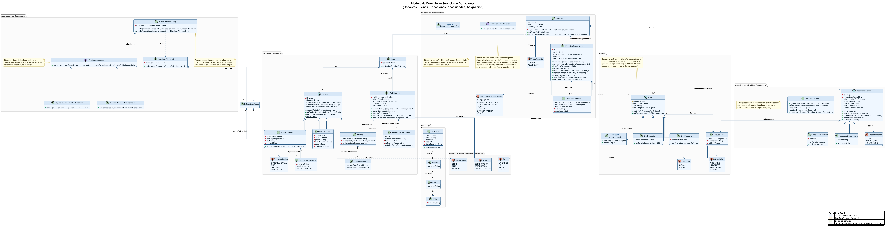
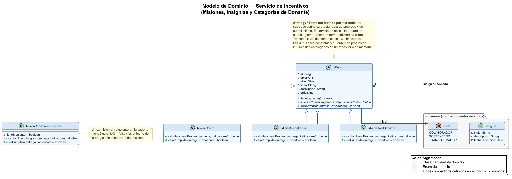
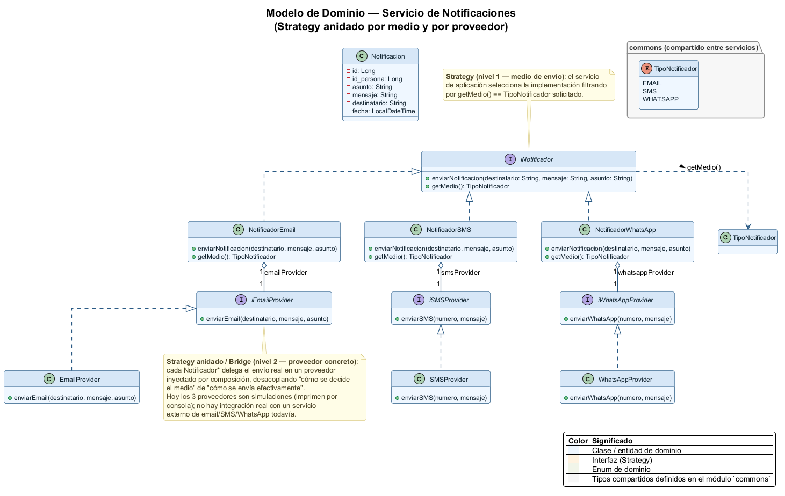
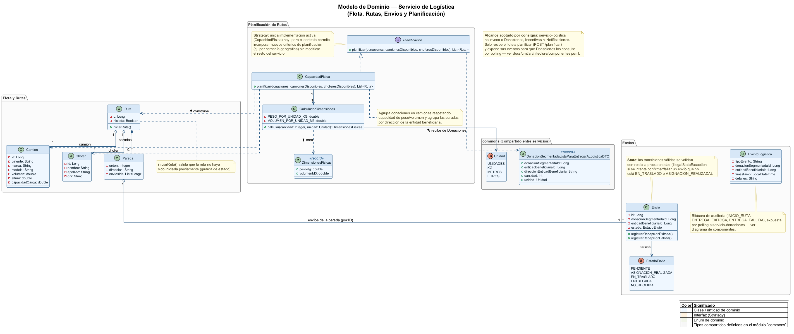
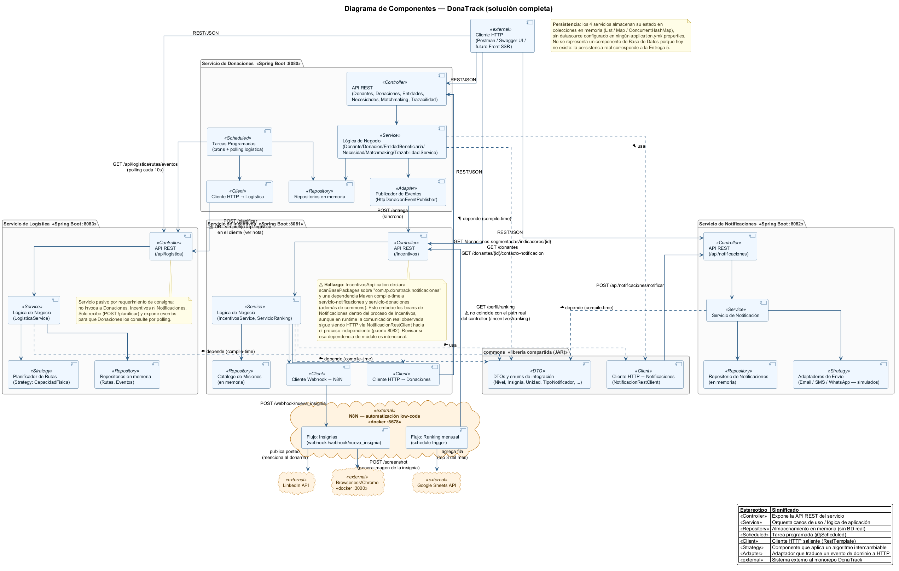
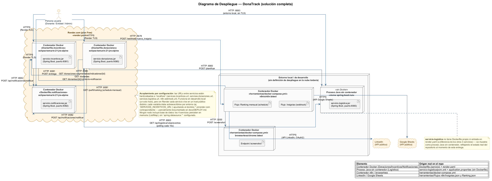
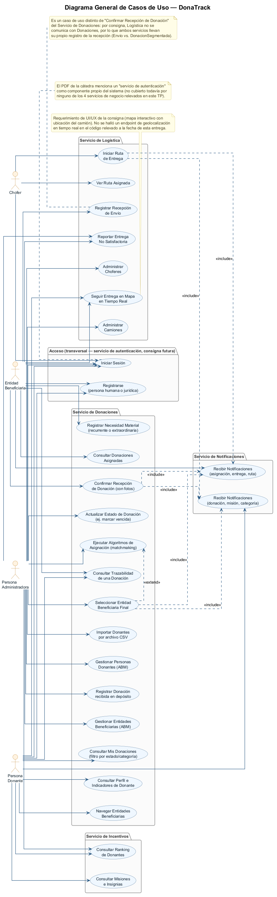

# Documentación UML — DonaTrack (Entrega 3)

Este directorio contiene toda la documentación UML del proyecto, generada en **PlantUML** a partir del código realmente implementado en el monorepo (módulos `servicio-donaciones`, `servicio-incentivos`, `servicio-notificaciones`, `servicio-logistica` y `commons`), más los artefactos reales de infraestructura (`Dockerfile.*`, `render.yaml`, `herramientas/docker-compose.yml`, flujos de `herramientas/Flujos n8n/`).

No se modeló nada que no tuviera respaldo verificable en el repositorio. Donde el código presenta una inconsistencia real (por ejemplo una URL que no coincide con el endpoint que dice invocar), se dejó documentada como nota en el propio diagrama en lugar de "corregirla" silenciosamente.

## Estructura

```
docs/uml/
├── _style.puml                     # skinparam compartido, incluido por !include en todos los diagramas
├── domain/
│   ├── donaciones.puml / .png      # Modelo de dominio — Servicio de Donaciones
│   ├── incentivos.puml / .png      # Modelo de dominio — Servicio de Incentivos
│   ├── notificaciones.puml / .png  # Modelo de dominio — Servicio de Notificaciones
│   └── logistica.puml / .png       # Modelo de dominio — Servicio de Logística
├── architecture/
│   ├── componentes.puml / .png     # Diagrama de Componentes — solución completa (único)
│   └── despliegue.puml / .png      # Diagrama de Despliegue — solución completa (único)
└── casos-de-uso/
    └── general.puml / .png         # Diagrama General de Casos de Uso (único)
```

## Índice de diagramas

| # | Diagrama | Archivo | Alcance |
|---|----------|---------|---------|
| 1 | Modelo de Dominio — Donaciones | [domain/donaciones.puml](domain/donaciones.puml) | Personas/Donantes, Bienes, Donación y Trazabilidad, Necesidades/Entidad Beneficiaria, Asignación (matchmaking), Ubicación. ~40 clases agrupadas en packages UML. |
| 2 | Modelo de Dominio — Incentivos | [domain/incentivos.puml](domain/incentivos.puml) | Jerarquía `Mision` (4 misiones concretas), `Insignia` y `Nivel` (de `commons`). |
| 3 | Modelo de Dominio — Notificaciones | [domain/notificaciones.puml](domain/notificaciones.puml) | Strategy anidado de notificadores (`iNotificador`) y proveedores (`iEmailProvider`/`iSMSProvider`/`iWhatsAppProvider`). |
| 4 | Modelo de Dominio — Logística | [domain/logistica.puml](domain/logistica.puml) | Flota y Rutas, Envíos, Planificación de rutas (Strategy `Planificacion`/`CapacidadFisica`). |
| 5 | Diagrama de Componentes | [architecture/componentes.puml](architecture/componentes.puml) | **Único**, toda la solución: los 4 servicios + `commons` + integraciones reales (HTTP síncrono, polling, webhook N8N, Browserless, LinkedIn, Google Sheets). |
| 6 | Diagrama de Despliegue | [architecture/despliegue.puml](architecture/despliegue.puml) | **Único**, toda la solución: contenedores Docker reales (Render), proceso sin contenedor (Logística) y contenedores locales de `herramientas/docker-compose.yml`. |
| 7 | Diagrama General de Casos de Uso | [casos-de-uso/general.puml](casos-de-uso/general.puml) | **Único**: 4 actores (Persona Donante, Entidad Beneficiaria, Persona Administradora, Chofer) y ~25 casos de uso agrupados por servicio. |

## Justificación de diseño: dominio separado por servicio, arquitectura y despliegue únicos

Esta asimetría es intencional y refleja la propia arquitectura distribuida de DonaTrack, no una decisión arbitraria de documentación:

- **El dominio se modela un diagrama por servicio** porque cada servicio (Donaciones, Incentivos, Notificaciones, Logística) es un **bounded context independiente**, con su propio modelo de objetos, su propio ciclo de vida y su propio código base (módulo Maven separado). Mezclar los 4 dominios en un único diagrama de clases:
  - Ocultaría que, por ejemplo, `Donaciones` y `Logística` modelan la "recepción de una entrega" con dos entidades completamente distintas y desacopladas (`DonacionSegmentada` vs. `Envio`) — justamente porque la consigna exige que Logística no dependa de Donaciones.
  - Forzaría relaciones de objeto directas entre agregados de distintos servicios que **no existen en el código real** (la comunicación real es HTTP entre procesos independientes, no una asociación de objetos en memoria).
  - Sería ilegible: solo el dominio de Donaciones ya tiene ~40 clases.
  - No es lo que la cátedra evalúa en esta sección: la consigna pide explícitamente "un diagrama de clases por servicio" tanto en la Entrega 1 como en la 3 ("Documentación e implementación... Modelo del Dominio: diagrama de clases **por servicio**").

- **La arquitectura (componentes) y el despliegue se modelan en un único diagrama** porque describen la **solución distribuida como un todo**: su valor está precisamente en mostrar cómo los servicios —cada uno con su propio dominio interno— se integran entre sí y con sistemas externos (N8N, Browserless, LinkedIn, Google Sheets) y cómo se distribuyen físicamente (contenedores Docker en Render, proceso local para Logística, contenedores locales de n8n/browserless). Partir estos diagramas por servicio haría invisible la información más importante que aportan: las integraciones cruzadas, los protocolos entre nodos y los puntos de acoplamiento real del sistema. La propia consigna lo pide así: "debe presentarse el diagrama de componentes y diagrama de despliegue **de la solución completa**".

- **El diagrama de casos de uso es único** porque los actores (persona donante, entidad beneficiaria, administradora, chofer) interactúan con el sistema como un todo, sin necesidad de conocer en qué servicio se resuelve cada caso de uso; se usan *packages* UML internos para mantener la trazabilidad hacia el servicio de negocio que lo implementa, sin fragmentar el diagrama.

## Hallazgos documentados durante el relevamiento (útiles para "Revisión general de aspectos destacados de Entrega 1 y 2")

Estos hallazgos surgieron de leer el código fuente real y quedaron anotados como notas dentro de los diagramas correspondientes, no fueron corregidos (no era parte del alcance de esta tarea):

1. **`LogisticaRestClient` (servicio-donaciones) arma la URL sin el prefijo `/api/logistica`**: hace `POST {services.logistica.url}/planificar`, pero `LogisticaController` expone `POST /api/logistica/planificar`. Ver nota en `architecture/componentes.puml`.
2. **El flujo N8N de ranking mensual llama a `GET /perfil/ranking`**, pero el endpoint real en `IncentivosController` es `GET /incentivos/ranking`. Ver nota en `architecture/componentes.puml`.
3. **`servicio-incentivos` declara una dependencia Maven de compilación y `scanBasePackages` sobre `servicio-notificaciones` (y también sobre `servicio-donaciones`)**, además de `commons`. Esto embebe los beans de Notificaciones dentro del proceso de Incentivos, aunque en runtime la comunicación observada sigue siendo HTTP hacia el proceso independiente de Notificaciones (puerto 8082) vía `NotificacionRestClient`. Ver nota en `architecture/componentes.puml`.
4. **`servicio-logistica` no tiene `Dockerfile` propio ni entrada en `render.yaml`**, a diferencia de los otros 3 servicios. Se documentó en el diagrama de despliegue como proceso Java sin contenedor, en lugar de inventar una configuración Docker inexistente.
5. **Acoplamiento por configuración a `localhost`**: las URLs de integración entre servicios (`services.incentivos.url`, `services.donaciones.url`, `services.logistica.url`, `n8n.webhook.url`) están hardcodeadas a `localhost` en los `application.yml/.properties`. Funciona en desarrollo local; en Render (donde cada servicio corre en un host público distinto) requiere sobreescribir esas variables por entorno.
6. **Ningún servicio tiene persistencia real configurada** (no hay `spring.datasource.*` en ningún módulo): los 4 servicios usan colecciones en memoria (`List`, `ArrayList`, `ConcurrentHashMap`, `CopyOnWriteArrayList`). Por eso ningún diagrama de arquitectura incluye un componente de base de datos — se documentó con una nota en vez de representar algo que no existe.
7. **`servicio-logistica/pom.xml` declara la dependencia `spring-boot-starter-data-jpa`** pero no se usa en ningún lado del código (no hay `@Entity` ni configuración de datasource).

## Cómo se renderizaron los diagramas

Los `.png` de este directorio ya están generados y versionados. Se renderizaron localmente con:

```bash
# PlantUML 1.2026.6 (jar oficial: https://github.com/plantuml/plantuml/releases)
java -DPLANTUML_LIMIT_SIZE=16384 -jar plantuml.jar docs/uml/domain/*.puml
java -DPLANTUML_LIMIT_SIZE=16384 -jar plantuml.jar docs/uml/architecture/*.puml
java -DPLANTUML_LIMIT_SIZE=16384 -jar plantuml.jar docs/uml/casos-de-uso/*.puml
```

> **Nota:** el flag `-DPLANTUML_LIMIT_SIZE=16384` es necesario porque el diagrama de dominio de Donaciones y el de componentes superan el límite por defecto de PlantUML (4096 px de ancho), lo que generaría un PNG recortado sin avisar.

### Si necesitás volver a renderizar

**Opción A — jar local (la que se usó acá):**
```bash
curl -L -o plantuml.jar https://github.com/plantuml/plantuml/releases/latest/download/plantuml.jar
java -DPLANTUML_LIMIT_SIZE=16384 -jar plantuml.jar docs/uml/**/*.puml
```

**Opción B — Docker (sin instalar nada):**
```bash
docker run --rm -v "${PWD}:/data" plantuml/plantuml -tpng /data/docs/uml/domain/*.puml
```

**Opción C — VS Code:** extensión "PlantUML" (jebbs.plantuml), `Alt+D` para previsualizar. Requiere Java y Graphviz instalados, o el server remoto configurado por la extensión.

**Opción D — online:** pegar el contenido del `.puml` (con el `!include ../_style.puml` reemplazado inline, ya que el editor online no resuelve rutas relativas) en https://www.plantuml.com/plantuml/uml/.

---

## 1. Estilo compartido — `_style.puml`

Todos los diagramas incluyen este archivo con `!include ../_style.puml` para mantener una paleta de colores y tipografía consistente entre el modelo de dominio, la arquitectura y los casos de uso.

```plantuml
' =========================================================
' Estilo compartido para todos los diagramas UML de DonaTrack
' Incluir con: !include ../_style.puml  (desde domain/, architecture/, casos-de-uso/)
' =========================================================

skinparam backgroundColor #FEFEFE
skinparam shadowing false
skinparam roundCorner 8
skinparam defaultFontName Helvetica
skinparam defaultFontSize 13
skinparam arrowThickness 1.2

skinparam titleFontSize 20
skinparam titleFontStyle bold

' ---- Clases (diagramas de dominio) ----
skinparam class {
    BackgroundColor #EFF6FF
    BorderColor #2B5B84
    ArrowColor #2B5B84
    FontColor #10222E
    AttributeFontColor #10222E
    AttributeFontSize 12
    StereotypeFontColor #2B5B84
    HeaderBackgroundColor #D6E7F7
}

skinparam interface {
    BackgroundColor #FFF3E0
    BorderColor #B9700A
    FontColor #4A2E00
}

skinparam enum {
    BackgroundColor #F1F4E8
    BorderColor #5B7A2B
    FontColor #2E3B14
}

skinparam package {
    BackgroundColor #FBFBFB
    BorderColor #8A8A8A
    FontColor #333333
    FontStyle bold
}

skinparam note {
    BackgroundColor #FFFDE7
    BorderColor #C9B458
    FontColor #4A4326
}

' ---- Componentes / despliegue (arquitectura) ----
skinparam component {
    BackgroundColor #EFF6FF
    BorderColor #2B5B84
    ArrowColor #2B5B84
    FontColor #10222E
}

skinparam database {
    BackgroundColor #F1F4E8
    BorderColor #5B7A2B
    FontColor #2E3B14
}

skinparam node {
    BackgroundColor #FBFBFB
    BorderColor #555555
    FontColor #222222
}

skinparam cloud {
    BackgroundColor #FFF3E0
    BorderColor #B9700A
    FontColor #4A2E00
}

skinparam queue {
    BackgroundColor #FDE8EC
    BorderColor #A03A52
    FontColor #4A1220
}

' ---- Casos de uso ----
skinparam usecase {
    BackgroundColor #EFF6FF
    BorderColor #2B5B84
    ArrowColor #2B5B84
    FontColor #10222E
}

skinparam actor {
    BackgroundColor #FFF3E0
    BorderColor #B9700A
    FontColor #10222E
}

skinparam linetype ortho
skinparam nodesep 45
skinparam ranksep 55
```

---

## 2. Modelo de Dominio — Servicio de Donaciones



Excluye deliberadamente controllers, services de orquestación, repositories y DTOs. Incluye 3 patrones de diseño: **Strategy** (`AlgoritmoAsignacion` con sus dos implementaciones de matchmaking), **Facade** (`ServicioMatchmaking`, que orquesta ambas estrategias) y **Template Method** (`Bien.getClaveAgrupacion()` sobre el hook `getCriterioSegmentacion()`), además del **puerto de dominio** `DonacionEventPublisher` (Observer desacoplado de infraestructura) y el **State** implícito de `DonacionSegmentada`/`EstadoDonacionSegmentada`.

```plantuml
@startuml donaciones
!include ../_style.puml

title Modelo de Dominio — Servicio de Donaciones\n(Donantes, Bienes, Donaciones, Necesidades, Asignación)

package "Personas y Donantes" {
    abstract class Persona {
        -id: Long
        -direccion: Direccion
        -medioDeContacto: Map<String, List<String>>
        -medioPredeterminado: Map<String, String>
        -fechaUltimaInteraccion: LocalDateTime
        --
        +agregarMedioDeContacto(clave, valor)
        +getTipoNotificadorPreferido(): TipoNotificador
        +getContactoPredeterminado(): String
        +{static} nextId(): Long
    }

    class PersonaHumana extends Persona {
        -nombre: String
        -apellido: String
        -genero: String
        -fechaNacimiento: Date
        -edad: Integer
        -nroDocumento: String
    }

    class PersonaJuridica extends Persona {
        -razonSocial: String
        -tipo: TipoOrganizacion
        -cuit: String
        -rubro: String
        --
        +agregarRepresentante(r: PersonaRepresentante)
    }

    class PersonaRepresentante {
        -nombre: String
        -apellido: String
        -nroDocumento: int
    }

    enum TipoOrganizacion {
        GUBERNAMENTAL
        ONG
        EMPRESA
        INSTITUCION
    }

    class Donante {
        -password: String
        --
        +getNombreCompleto(): String
    }

    class PerfilDonante {
        -visibilidadInsignia: boolean
        -misionActualId: Long
        -insigniasGanadas: List<String>
        -progreso: Double
        -nivelDonante: Nivel
        --
        +registrarEntrega(segmentada: DonacionSegmentada)
        +contarCategoriasUnicas(): int
        +calcularRachaMeses(): int
        +calcularDonacionesAEntidadesBeneficiarias(): int
        +calcularCantidadDonacionesEntregadas(): int
    }

    class Metrica {
        -totalDonacionesExitosas: Integer
        -categoriasAyudadas: List<CategoriaBien>
        -misionesCompletadas: List<Long>
    }

    class ItemHistoralDonaciones {
        -id: Long
        -entidadBeneficiariaId: Long
        -fecha: LocalDate
        -categoria: CategoriaBien
        -estado: EstadoDonacionSegmentada
    }

    class EntidadAyudada {
        -entidadBeneficiariaId: Long
        -donacionSegmentadaId: Long
    }
}

Persona <|-- PersonaHumana
Persona <|-- PersonaJuridica
PersonaJuridica "1" *-- "0..*" PersonaRepresentante : representantes
PersonaJuridica --> TipoOrganizacion
Donante "1" *-- "1" Persona : persona
Donante "1" *-- "1" PerfilDonante : perfil
PerfilDonante "1" *-- "1" Metrica : metricasPerfil
PerfilDonante "1" *-- "0..*" ItemHistoralDonaciones : historialDonaciones
Metrica "1" o-- "0..*" EntidadAyudada : entidadesAyudadas

package "Bienes" {
    abstract class Bien {
        #nombre: String
        #descripcion: String
        #foto: String
        #subCategoria: SubCategoria
        --
        +{abstract} getCriterioSegmentacion(): Object
        +getClaveAgrupacion(): ClaveAgrupacion
    }

    class BienDuradero extends Bien {
        -estado: EstadoBien
        +getCriterioSegmentacion(): Object
    }

    class BienPerecedero extends Bien {
        -fechaVencimiento: Date
        +getCriterioSegmentacion(): Object
    }

    enum EstadoBien {
        NUEVO
        USADO
    }

    enum CategoriaBien {
        MOBILIARIO
        ALIMENTOS
        VESTIMENTA
        HIGIENE
    }

    class SubCategoria {
        -categoria: CategoriaBien
        -descripcion: String
        -unidad: Unidad
    }

    class ClaveAgrupacion <<record>> {
        +subCategoria: SubCategoria
        +criterio: Object
    }

    note top of Bien
        **Template Method**: getClaveAgrupacion() es el
        método concreto que invoca el hook abstracto
        getCriterioSegmentacion(), redefinido por cada
        subclase (estado vs. fecha de vencimiento).
    end note
}

Bien <|-- BienDuradero
Bien <|-- BienPerecedero
Bien "0..*" --> "1" SubCategoria : subCategoria
Bien ..> ClaveAgrupacion : construye >
SubCategoria --> CategoriaBien
BienDuradero --> EstadoBien

package "Donación y Trazabilidad" {
    class Donacion {
        -id: Integer
        -descripcion: String
        -fechaIngreso: Date
        --
        -segmentar(bienes: List<Bien>): List<DonacionSegmentada>
        +getEstado(): EstadoDonacion
        +buscarPorSubcategoria(sub: SubCategoria): Optional<DonacionSegmentada>
    }

    enum EstadoDonacion {
        PENDIENTE
        ADJUDICADA
    }

    class DonacionSegmentada {
        -id: Long
        -cantidad: int
        -estado: EstadoDonacionSegmentada
        -donanteId: Long
        -entidadBeneficiariaAsignadaId: Long
        --
        +transicionar(nuevoEstado, actor, descripcion)
        +asignar(entidad: EntidadBeneficiaria, actor: String)
        +listarParaEntrega(actor: String)
        +iniciarTraslado(actor: String)
        +confirmarEntrega(entidadBeneficiariaId: Long)
        +registrarEntregaFallida(actor, justificacion)
        +marcarVencida(actor: String)
        +transicionPosible(anterior, nuevo): boolean
        +getUltimoEvento(): EventoTrazabilidad
    }

    enum EstadoDonacionSegmentada {
        EN_DEPOSITO
        ASIGNACION_REALIZADA
        LISTA_PARA_ENTREGAR
        EN_TRASLADO
        ENTREGADA
        ENTREGA_FALLIDA
        VENCIDA
    }

    interface DonacionEventPublisher {
        +publicar(event: DonacionEntregadaEvent)
    }

    class DonacionEntregadaEvent <<record>>

    class EventoTrazabilidad {
        -estadoAnterior: EstadoDonacionSegmentada
        -estadoNuevo: EstadoDonacionSegmentada
        -fecha: LocalDateTime
        -actor: String
        -descripcion: String
    }

    note bottom of DonacionEventPublisher
        **Puerto de dominio** (Observer desacoplado):
        el dominio dispara el evento "donación entregada"
        sin conocer que existe una llamada HTTP detrás.
        Implementado por HttpDonacionEventPublisher
        en la capa de aplicación (no se muestra aquí).
    end note

    note top of EstadoDonacionSegmentada
        **State**: transicionPosible() en DonacionSegmentada
        define, mediante un switch exhaustivo, la máquina
        de estados finita de este enum.
    end note
}

Donacion "1" o-- "1" Donante : donante
Donacion "1" *-- "1..*" Bien : bienes
Donacion "1" *-- "1..*" DonacionSegmentada : donacionesSegmentadas
Donacion --> EstadoDonacion : deriva >
DonacionSegmentada "1" *-- "1..*" Bien : bienes
DonacionSegmentada "1" *-- "0..*" EventoTrazabilidad : historial
DonacionSegmentada --> EstadoDonacionSegmentada : estado
DonacionSegmentada ..> EntidadBeneficiaria : asigna >

package "Necesidades y Entidad Beneficiaria" {
    abstract class NecesidadMaterial {
        -id: Long
        -entidadBeneficiariaId: Long
        -subCategoria: SubCategoria
        -fechaDelPedido: Date
        -cantidadObjetivo: int
        -cantidadRecibida: int
        -estado: EstadoNecesidad
        --
        +activo(): boolean
        +cantidadFaltanteDelPedido(): int
        +recibirDonacion(donacion: DonacionSegmentada)
        +recibirBienes(cantidad: int)
        +finalizarNecesidad()
    }

    class NecesidadRecurrente extends NecesidadMaterial {
        -dias: int
        --
        +enPeriodo(): boolean
        +activo(): boolean
    }

    class NecesidadExtraordinaria extends NecesidadMaterial {
        -causa: String
        --
        +adeudadas(): int
    }

    enum EstadoNecesidad {
        ACTIVO
        SATISFECHO
        INSATISFECHO
    }

    class EntidadBeneficiaria {
        --
        +agregarNecesidad(necesidad: NecesidadMaterial)
        +removerNecesidad(necesidad: NecesidadMaterial)
        +getCantNecesidades(): int
        +getCantNececidadesActivas(): int
        +implementarDonacion(donacion: DonacionSegmentada)
    }

    note top of NecesidadRecurrente
        activo() sobrescribe el comportamiento heredado:
        una necesidad recurrente deja de estar activa
        (y se finaliza) si venció su período (dias).
    end note
}

NecesidadMaterial <|-- NecesidadRecurrente
NecesidadMaterial <|-- NecesidadExtraordinaria
NecesidadMaterial --> EstadoNecesidad : estado
NecesidadMaterial "0..*" --> "1" SubCategoria : subCategoria
NecesidadMaterial "1" o-- "0..*" DonacionSegmentada : donaciones recibidas
EntidadBeneficiaria "1" *-- "1" PersonaJuridica : datosDeEntidad
EntidadBeneficiaria "1" *-- "0..*" NecesidadMaterial : nececidades

package "Asignación de Donaciones" {
    interface AlgoritmoAsignacion {
        +rankear(donacion: DonacionSegmentada, entidades: List<EntidadBeneficiaria>): List<EntidadBeneficiaria>
    }

    class AlgoritmoCompatibilidadSemantica {
        +rankear(donacion, entidades): List<EntidadBeneficiaria>
    }

    class AlgoritmoPrioridadSubAtendidos {
        +rankear(donacion, entidades): List<EntidadBeneficiaria>
    }

    class ServicioMatchmaking {
        -algoritmos: List<AlgoritmoAsignacion>
        --
        +ejecutar(donacion: DonacionSegmentada, entidades): ResultadoMatchmaking
        +ejecutarTodas(donaciones, entidades): List<ResultadoMatchmaking>
    }

    class ResultadoMatchmaking {
        -huboCoincidencias: boolean
        --
        +getEntidadesPropuestas(): List<EntidadBeneficiaria>
    }

    note left of AlgoritmoAsignacion
        **Strategy**: dos criterios intercambiables
        para rankear hasta 10 entidades beneficiarias
        candidatas a recibir una donación.
    end note

    note bottom of ServicioMatchmaking
        **Facade**: orquesta ambas estrategias sobre
        una misma donación y combina los resultados
        (intersección de rankings) en un único objeto.
    end note
}

AlgoritmoAsignacion <|.. AlgoritmoCompatibilidadSemantica
AlgoritmoAsignacion <|.. AlgoritmoPrioridadSubAtendidos
ServicioMatchmaking "1" o-- "2" AlgoritmoAsignacion : algoritmos
ServicioMatchmaking ..> ResultadoMatchmaking : crea >
ResultadoMatchmaking "1" o-- "0..*" EntidadBeneficiaria : propuestas

package "Ubicación" {
    class Direccion {
        -calle1: String
        -calle2: String
        -altura: int
        -piso: int
        -departamento: String
        --
        +getDireccion(): String
    }

    class Ciudad {
        -nombre: String
    }

    class Provincia {
        -nombre: String
    }

    class Pais {
        -nombre: String
    }
}

Direccion "1" --> "1" Ciudad : ciudad
Ciudad "1" --> "1" Provincia : provincia
Provincia "1" --> "1" Pais : pais
Persona "1" *-- "1" Direccion : direccion

package "commons (compartido entre servicios)" #F7F7F7 {
    enum Nivel {
        COLABORADOR
        SOSTENEDOR
        TRANSFORMADOR
    }

    enum TipoNotificador {
        EMAIL
        SMS
        WHATSAPP
    }

    enum Unidad {
        UNIDADES
        KG
        METROS
        LITROS
    }
}

PerfilDonante --> Nivel : nivelDonante
SubCategoria --> Unidad : unidad
Persona ..> TipoNotificador : retorna >

legend right
    |= Color |= Significado |
    | <back:#EFF6FF>     </back> | Clase / entidad de dominio |
    | <back:#FFF3E0>     </back> | Interfaz (Strategy / puerto) |
    | <back:#F1F4E8>     </back> | Enum de dominio |
    | <back:#F7F7F7>     </back> | Tipos compartidos definidos en el módulo `commons` |
endlegend

@enduml
```

---

## 3. Modelo de Dominio — Servicio de Incentivos



Patrón **Strategy / Template Method por herencia**: `Mision` es abstracta y cada una de las 4 misiones concretas define su propia regla de progreso (`calcularNuevoProgreso`) y de cumplimiento (`estaCumplida`), permitiendo que la capa de aplicación opere polimórficamente sobre la "misión actual" sin `switch`/`instanceof`.

```plantuml
@startuml incentivos
!include ../_style.puml

title Modelo de Dominio — Servicio de Incentivos\n(Misiones, Insignias y Categorías de Donante)

abstract class Mision {
    -id: Long
    -objetivo: int
    -nivel: Nivel
    -titulo: String
    -descripcion: String
    -orden: int
    --
    +tieneSiguiente(): boolean
    +{abstract} calcularNuevoProgreso(entrega, indicadores): double
    +{abstract} estaCumplida(entrega, indicadores): boolean
}

class MisionRacha extends Mision {
    +calcularNuevoProgreso(entrega, indicadores): double
    +estaCumplida(entrega, indicadores): boolean
}

class MisionCompletitud extends Mision {
    +calcularNuevoProgreso(entrega, indicadores): double
    +estaCumplida(entrega, indicadores): boolean
}

class MisionHabilDonador extends Mision {
    +calcularNuevoProgreso(entrega, indicadores): double
    +estaCumplida(entrega, indicadores): boolean
}

class MisionDonacionesExitosas extends Mision {
    +tieneSiguiente(): boolean
    +calcularNuevoProgreso(entrega, indicadores): double
    +estaCumplida(entrega, indicadores): boolean
}

note top of Mision
    **Strategy / Template Method por herencia**: cada
    subclase define su propia regla de progreso y de
    cumplimiento. El servicio de aplicación (fuera de
    este diagrama) opera de forma polimórfica sobre la
    "misión actual" del donante, sin switch/instanceof.
    Las 4 misiones concretas y su orden de progresión
    (1→4) están catalogadas en un repositorio en memoria.
end note

note right of MisionDonacionesExitosas
    Única misión sin siguiente en la cadena
    (tieneSiguiente() = false): es el techo de
    la progresión secuencial de misiones.
end note

package "commons (compartido entre servicios)" #F7F7F7 {
    class Insignia {
        -titulo: String
        -descripcion: String
        -fechaObtencion: Date
    }

    enum Nivel {
        COLABORADOR
        SOSTENEDOR
        TRANSFORMADOR
    }
}

Mision "1" *-- "1" Insignia : insigniaAsociada
Mision --> Nivel : nivel

legend right
    |= Color |= Significado |
    | <back:#EFF6FF>     </back> | Clase / entidad de dominio |
    | <back:#F1F4E8>     </back> | Enum de dominio |
    | <back:#F7F7F7>     </back> | Tipos compartidos definidos en el módulo `commons` |
endlegend

@enduml
```

---

## 4. Modelo de Dominio — Servicio de Notificaciones



**Strategy anidado en dos niveles**: nivel 1 (medio de envío) resuelto por `iNotificador`/`NotificadorEmail`/`NotificadorSMS`/`NotificadorWhatsApp`; nivel 2 (proveedor concreto) delegado por composición a `iEmailProvider`/`iSMSProvider`/`iWhatsAppProvider` — un diseño también interpretable como **Bridge** entre "qué medio se eligió" y "cómo se envía realmente".

```plantuml
@startuml notificaciones
!include ../_style.puml

title Modelo de Dominio — Servicio de Notificaciones\n(Strategy anidado por medio y por proveedor)

class Notificacion {
    -id: Long
    -id_persona: Long
    -asunto: String
    -mensaje: String
    -destinatario: String
    -fecha: LocalDateTime
}

interface iNotificador {
    +enviarNotificacion(destinatario: String, mensaje: String, asunto: String)
    +getMedio(): TipoNotificador
}

class NotificadorEmail {
    +enviarNotificacion(destinatario, mensaje, asunto)
    +getMedio(): TipoNotificador
}

class NotificadorSMS {
    +enviarNotificacion(destinatario, mensaje, asunto)
    +getMedio(): TipoNotificador
}

class NotificadorWhatsApp {
    +enviarNotificacion(destinatario, mensaje, asunto)
    +getMedio(): TipoNotificador
}

interface iEmailProvider {
    +enviarEmail(destinatario, mensaje, asunto)
}

interface iSMSProvider {
    +enviarSMS(numero, mensaje)
}

interface iWhatsAppProvider {
    +enviarWhatsApp(numero, mensaje)
}

class EmailProvider {
    +enviarEmail(destinatario, mensaje, asunto)
}

class SMSProvider {
    +enviarSMS(numero, mensaje)
}

class WhatsAppProvider {
    +enviarWhatsApp(numero, mensaje)
}

iNotificador <|.. NotificadorEmail
iNotificador <|.. NotificadorSMS
iNotificador <|.. NotificadorWhatsApp

iEmailProvider <|.. EmailProvider
iSMSProvider <|.. SMSProvider
iWhatsAppProvider <|.. WhatsAppProvider

NotificadorEmail "1" o-- "1" iEmailProvider : emailProvider
NotificadorSMS "1" o-- "1" iSMSProvider : smsProvider
NotificadorWhatsApp "1" o-- "1" iWhatsAppProvider : whatsappProvider

iNotificador ..> TipoNotificador : getMedio() >

package "commons (compartido entre servicios)" #F7F7F7 {
    enum TipoNotificador {
        EMAIL
        SMS
        WHATSAPP
    }
}

note top of iNotificador
    **Strategy (nivel 1 — medio de envío)**: el servicio
    de aplicación selecciona la implementación filtrando
    por getMedio() == TipoNotificador solicitado.
end note

note bottom of iEmailProvider
    **Strategy anidado / Bridge (nivel 2 — proveedor concreto)**:
    cada Notificador* delega el envío real en un proveedor
    inyectado por composición, desacoplando "cómo se decide
    el medio" de "cómo se envía efectivamente".
    Hoy los 3 proveedores son simulaciones (imprimen por
    consola); no hay integración real con un servicio
    externo de email/SMS/WhatsApp todavía.
end note

legend right
    |= Color |= Significado |
    | <back:#EFF6FF>     </back> | Clase / entidad de dominio |
    | <back:#FFF3E0>     </back> | Interfaz (Strategy) |
    | <back:#F1F4E8>     </back> | Enum de dominio |
    | <back:#F7F7F7>     </back> | Tipos compartidos definidos en el módulo `commons` |
endlegend

@enduml
```

---

## 5. Modelo de Dominio — Servicio de Logística



**Strategy** de planificación (`Planificacion`/`CapacidadFisica`, con espacio para incorporar nuevos criterios sin tocar el resto del servicio) y **State** implícito en `Envio`/`EstadoEnvio`. Incluye una nota explícita sobre el alcance acotado que exige la consigna: Logística no invoca a Donaciones, Incentivos ni Notificaciones.

```plantuml
@startuml logistica
!include ../_style.puml

title Modelo de Dominio — Servicio de Logística\n(Flota, Rutas, Envíos y Planificación)

package "Flota y Rutas" {
    class Camion {
        -id: Long
        -patente: String
        -marca: String
        -modelo: String
        -volumen: double
        -altura: double
        -capacidadCarga: double
    }

    class Chofer {
        -id: Long
        -nombre: String
        -apellido: String
        -dni: String
    }

    class Ruta {
        -id: Long
        -iniciada: Boolean
        --
        +iniciarRuta()
    }

    class Parada {
        -orden: Integer
        -direccion: String
        -enviosIds: List<Long>
    }

    note bottom of Ruta
        iniciarRuta() valida que la ruta no haya
        sido iniciada previamente (guarda de estado).
    end note
}

Ruta "1" o-- "1" Camion : camion
Ruta "1" o-- "1" Chofer : chofer
Ruta "1" *-- "0..*" Parada : paradas

package "Envíos" {
    class Envio {
        -id: Long
        -donacionSegmentadaId: Long
        -entidadBeneficiariaId: Long
        -estado: EstadoEnvio
        --
        +registrarRecepcionExitosa()
        +registrarRecepcionFallida()
    }

    enum EstadoEnvio {
        PENDIENTE
        ASIGNACION_REALIZADA
        EN_TRASLADO
        ENTREGADA
        NO_RECIBIDA
    }

    class EventoLogistica {
        -tipoEvento: String
        -donacionSegmentadaId: Long
        -entidadBeneficiariaId: Long
        -timestamp: LocalDateTime
        -detalles: String
    }

    note top of Envio
        **State**: las transiciones válidas se validan
        dentro de la propia entidad (IllegalStateException
        si se intenta confirmar/fallar un envío que no
        está EN_TRASLADO o ASIGNACION_REALIZADA).
    end note

    note bottom of EventoLogistica
        Bitácora de auditoría (INICIO_RUTA,
        ENTREGA_EXITOSA, ENTREGA_FALLIDA), expuesta
        por polling a servicio-donaciones — ver
        diagrama de componentes.
    end note
}

Envio --> EstadoEnvio : estado
Parada "1" o-- "1..*" Envio : envíos de la parada (por ID)

package "Planificación de Rutas" {
    interface Planificacion {
        +planificar(donaciones, camionesDisponibles, choferesDisponibles): List<Ruta>
    }

    class CapacidadFisica {
        +planificar(donaciones, camionesDisponibles, choferesDisponibles): List<Ruta>
    }

    class CalculadorDimensiones {
        -PESO_POR_UNIDAD_KG: double
        -VOLUMEN_POR_UNIDAD_M3: double
        --
        +calcular(cantidad: Integer, unidad: Unidad): DimensionesFisicas
    }

    class DimensionesFisicas <<record>> {
        +pesoKg: double
        +volumenM3: double
    }

    note left of Planificacion
        **Strategy**: única implementación activa
        (CapacidadFisica) hoy, pero el contrato permite
        incorporar nuevos criterios de planificación
        (ej. por cercanía geográfica) sin modificar
        el resto del servicio.
    end note

    note bottom of CapacidadFisica
        Agrupa donaciones en camiones respetando
        capacidad de peso/volumen y agrupa las paradas
        por dirección de la entidad beneficiaria.
    end note
}

Planificacion <|.. CapacidadFisica
CapacidadFisica "1" --> "1" CalculadorDimensiones
CalculadorDimensiones ..> DimensionesFisicas : crea >
CapacidadFisica ..> Ruta : construye >
CapacidadFisica ..> Camion
CapacidadFisica ..> Chofer

package "commons (compartido entre servicios)" #F7F7F7 {
    class DonacionSegmentadaListaParaEntregarALogisticaDTO <<record>> {
        +donacionSegmentadaId: Long
        +entidadBeneficiariaId: Long
        +direccionEntidadBeneficiaria: String
        +cantidad: int
        +unidad: Unidad
    }

    enum Unidad {
        UNIDADES
        KG
        METROS
        LITROS
    }
}

Planificacion ..> DonacionSegmentadaListaParaEntregarALogisticaDTO : recibe de Donaciones >
CalculadorDimensiones --> Unidad

note as N1
    **Alcance acotado por consigna**: servicio-logistica
    no invoca a Donaciones, Incentivos ni Notificaciones.
    Solo recibe el lote a planificar (POST /planificar)
    y expone sus eventos para que Donaciones los consulte
    por polling — ver docs/uml/architecture/componentes.puml.
end note

legend right
    |= Color |= Significado |
    | <back:#EFF6FF>     </back> | Clase / entidad de dominio |
    | <back:#FFF3E0>     </back> | Interfaz (Strategy) |
    | <back:#F1F4E8>     </back> | Enum de dominio |
    | <back:#F7F7F7>     </back> | Tipos compartidos definidos en el módulo `commons` |
endlegend

@enduml
```

---

## 6. Diagrama de Componentes (único, solución completa)



Cada servicio se representa como un `package` con sus componentes internos estereotipados (`<<Controller>>`, `<<Service>>`, `<<Repository>>`, `<<Scheduled>>`, `<<Client>>`, `<<Strategy>>`, `<<Adapter>>`) — no clase por clase. Las flechas entre componentes de distintos packages son las integraciones **reales** encontradas en el código (HTTP síncrono vía `RestTemplate`, polling, webhook de N8N). Se incluyen los sistemas externos reales (N8N, Browserless/Chrome, LinkedIn, Google Sheets) y una nota explicando por qué no hay un componente de base de datos.

```plantuml
@startuml componentes
!include ../_style.puml

title Diagrama de Componentes — DonaTrack (solución completa)

skinparam component {
    BackgroundColor #EFF6FF
    BorderColor #2B5B84
}

component "Cliente HTTP\n(Postman / Swagger UI /\nfuturo Front SSR)" as Cliente <<external>>

package "Servicio de Donaciones  «Spring Boot :8080»" {
    [API REST\n(Donantes, Donaciones, Entidades,\nNecesidades, Matchmaking, Trazabilidad)] as Don_Controller <<Controller>>
    [Lógica de Negocio\n(Donante/Donacion/EntidadBeneficiaria/\nNecesidad/Matchmaking/Trazabilidad Service)] as Don_Service <<Service>>
    [Repositorios en memoria] as Don_Repo <<Repository>>
    [Tareas Programadas\n(crons + polling logística)] as Don_Tasks <<Scheduled>>
    [Cliente HTTP → Logística] as Don_ClientLog <<Client>>
    [Publicador de Eventos\n(HttpDonacionEventPublisher)] as Don_Publisher <<Adapter>>

    Don_Controller --> Don_Service
    Don_Service --> Don_Repo
    Don_Tasks --> Don_Repo
    Don_Service --> Don_Publisher
    Don_Tasks --> Don_ClientLog
}

package "Servicio de Incentivos  «Spring Boot :8081»" {
    [API REST\n(/incentivos)] as Inc_Controller <<Controller>>
    [Lógica de Negocio\n(IncentivosService, ServicioRanking)] as Inc_Service <<Service>>
    [Catálogo de Misiones\n(en memoria)] as Inc_Repo <<Repository>>
    [Cliente HTTP → Donaciones] as Inc_ClientDon <<Client>>
    [Cliente Webhook → N8N] as Inc_ClientN8N <<Client>>

    Inc_Controller --> Inc_Service
    Inc_Service --> Inc_Repo
    Inc_Service --> Inc_ClientDon
    Inc_Service --> Inc_ClientN8N

    note bottom of Inc_Controller
        ⚠ **Hallazgo**: IncentivosApplication declara
        scanBasePackages sobre "com.tp.donatrack.notificaciones"
        y una dependencia Maven compile-time a
        servicio-notificaciones y servicio-donaciones
        (además de commons). Esto embebe los beans de
        Notificaciones dentro del proceso de Incentivos,
        aunque en runtime la comunicación real observada
        sigue siendo HTTP vía NotificacionRestClient hacia
        el proceso independiente (puerto 8082). Revisar si
        esa dependencia de módulo es intencional.
    end note
}

package "Servicio de Notificaciones  «Spring Boot :8082»" {
    [API REST\n(/api/notificaciones)] as Not_Controller <<Controller>>
    [Servicio de Notificación] as Not_Service <<Service>>
    [Repositorio de Notificaciones\n(en memoria)] as Not_Repo <<Repository>>
    [Adaptadores de Envío\n(Email / SMS / WhatsApp — simulados)] as Not_Strategy <<Strategy>>

    Not_Controller --> Not_Service
    Not_Service --> Not_Repo
    Not_Service --> Not_Strategy
}

package "Servicio de Logística  «Spring Boot :8083»" {
    [API REST\n(/api/logistica)] as Log_Controller <<Controller>>
    [Lógica de Negocio\n(LogisticaService)] as Log_Service <<Service>>
    [Planificador de Rutas\n(Strategy: CapacidadFisica)] as Log_Strategy <<Strategy>>
    [Repositorios en memoria\n(Rutas, Eventos)] as Log_Repo <<Repository>>

    Log_Controller --> Log_Service
    Log_Service --> Log_Strategy
    Log_Service --> Log_Repo

    note bottom of Log_Controller
        Servicio pasivo por requerimiento de consigna:
        no invoca a Donaciones, Incentivos ni Notificaciones.
        Solo recibe (POST /planificar) y expone eventos
        para que Donaciones los consulte por polling.
    end note
}

package "commons  «librería compartida (JAR)»" #F7F7F7 {
    [Cliente HTTP → Notificaciones\n(NotificacionRestClient)] as Commons_Client <<Client>>
    [DTOs y enums de integración\n(Nivel, Insignia, Unidad, TipoNotificador, ...)] as Commons_DTO <<DTO>>
}

cloud "N8N — automatización low-code\n«docker :5678»" as N8N <<external>> {
    [Flujo: Insignias\n(webhook /webhook/nueva_insignia)] as N8N_Insignias
    [Flujo: Ranking mensual\n(schedule trigger)] as N8N_Ranking
}

cloud "Browserless/Chrome\n«docker :3000»" as Browserless <<external>>
cloud "LinkedIn API" as LinkedIn <<external>>
cloud "Google Sheets API" as GSheets <<external>>

' ===================== Cliente externo =====================
Cliente --> Don_Controller : REST/JSON
Cliente --> Inc_Controller : REST/JSON
Cliente --> Not_Controller : REST/JSON
Cliente --> Log_Controller : REST/JSON

' ===================== Integraciones entre servicios (síncronas HTTP) =====================
Don_Publisher --> Inc_Controller : POST /entrega\n(síncrono)
Don_ClientLog --> Log_Controller : POST /planificar\n⚠ URL sin prefijo /api/logistica\nen el cliente (ver nota)
Don_Tasks --> Log_Controller : GET /api/logistica/rutas/eventos\n(polling cada 10s)

Inc_ClientDon --> Don_Controller : GET /donaciones-segmentadas/indicadores/{id}\nGET /donantes\nGET /donantes/{id}/contacto-notificacion

Don_Service ..> Commons_Client : usa >
Inc_Service ..> Commons_Client : usa >
Commons_Client --> Not_Controller : POST /api/notificaciones/notificar

' ===================== Dependencia de compilación con commons =====================
Don_Service ..> Commons_DTO : depende (compile-time) >
Inc_Service ..> Commons_DTO : depende (compile-time) >
Not_Service ..> Commons_DTO : depende (compile-time) >
Log_Service ..> Commons_DTO : depende (compile-time) >

' ===================== Integraciones externas reales =====================
Inc_ClientN8N --> N8N_Insignias : POST /webhook/nueva_insignia
N8N_Insignias --> Browserless : POST /screenshot\n(genera imagen de la insignia)
N8N_Insignias --> LinkedIn : publica posteo\n(menciona al donante)

N8N_Ranking --> Inc_Controller : GET /perfil/ranking\n⚠ no coincide con el path real\ndel controller (/incentivos/ranking)
N8N_Ranking --> GSheets : agrega fila\n(top 3 del mes)

note as NotaPersistencia
    **Persistencia**: los 4 servicios almacenan su estado en
    colecciones en memoria (List / Map / ConcurrentHashMap),
    sin datasource configurado en ningún application.yml/.properties.
    No se representa un componente de Base de Datos porque hoy
    no existe: la persistencia real corresponde a la Entrega 5.
end note

legend right
    |= Estereotipo |= Significado |
    | <<Controller>> | Expone la API REST del servicio |
    | <<Service>> | Orquesta casos de uso / lógica de aplicación |
    | <<Repository>> | Almacenamiento en memoria (sin BD real) |
    | <<Scheduled>> | Tarea programada (@Scheduled) |
    | <<Client>> | Cliente HTTP saliente (RestTemplate) |
    | <<Strategy>> | Componente que aplica un algoritmo intercambiable |
    | <<Adapter>> | Adaptador que traduce un evento de dominio a HTTP |
    | <<external>> | Sistema externo al monorepo DonaTrack |
endlegend

@enduml
```

---

## 7. Diagrama de Despliegue (único, solución completa)



Basado exclusivamente en `Dockerfile.donaciones`, `Dockerfile.incentivos`, `Dockerfile.notificaciones`, `render.yaml` y `herramientas/docker-compose.yml`. `servicio-logistica` no tiene Dockerfile propio ni entrada en `render.yaml`, por lo que se representa como proceso Java sin contenedor en vez de inventar una configuración inexistente.

```plantuml
@startuml despliegue
!include ../_style.puml

title Diagrama de Despliegue — DonaTrack (solución completa)

actor "Persona usuaria\n(Donante / Entidad / Admin)" as Usuario

cloud "Render.com (plan Free)\n«render.yaml»" as Render {

    node "Contenedor Docker\n«Dockerfile.donaciones»\neclipse-temurin:21-jre-alpine" as NodeDon {
        artifact "servicio-donaciones.jar\n(Spring Boot, puerto 8080)" as JarDon
    }

    node "Contenedor Docker\n«Dockerfile.notificaciones»\neclipse-temurin:21-jre-alpine" as NodeNot {
        artifact "servicio-notificaciones.jar\n(Spring Boot, puerto 8082)" as JarNot
    }

    node "Contenedor Docker\n«Dockerfile.incentivos»\neclipse-temurin:21-jre-alpine" as NodeInc {
        artifact "servicio-incentivos.jar\n(Spring Boot, puerto 8081)" as JarInc
    }
}

node "Entorno local / de desarrollo\n(sin definición de despliegue en la nube todavía)" as LocalEnv {

    node "Proceso Java sin contenedor\n«mvnw spring-boot:run»" as NodeLog <<sin Docker>> {
        artifact "servicio-logistica.jar\n(Spring Boot, puerto 8083)" as JarLog
    }

    node "Contenedor Docker\n«herramientas/docker-compose.yml»\nn8nio/n8n:latest" as NodeN8N {
        artifact "Flujo: Insignias (webhook)" as FlowInsignias
        artifact "Flujo: Ranking mensual (schedule)" as FlowRanking
    }

    node "Contenedor Docker\n«herramientas/docker-compose.yml»\nbrowserless/chrome:latest" as NodeBrowserless {
        artifact "Endpoint /screenshot" as ArtScreenshot
    }
}

cloud "LinkedIn\n(API pública)" as LinkedIn
cloud "Google Sheets\n(API pública)" as GSheets

' ===================== Cliente =====================
Usuario --> NodeDon : HTTPS\n(Render TLS)
Usuario --> NodeInc : HTTPS\n(Render TLS)
Usuario --> NodeNot : HTTPS\n(Render TLS)
Usuario --> NodeLog : HTTP :8083\n(entorno local, sin TLS)

' ===================== Integraciones entre nodos (protocolo real: HTTP/JSON síncrono) =====================
NodeDon --> NodeInc : HTTP :8081\nPOST /entrega
NodeInc --> NodeDon : HTTP :8080\nGET /donaciones-segmentadas/indicadores/{id}\nGET /donantes\nGET /donantes/{id}/contacto-notificacion
NodeDon --> NodeNot : HTTP :8082\nPOST /api/notificaciones/notificar
NodeInc --> NodeNot : HTTP :8082\nPOST /api/notificaciones/notificar
NodeDon --> NodeLog : HTTP :8083\nPOST /planificar
NodeDon --> NodeLog : HTTP :8083\nGET /api/logistica/rutas/eventos\n(polling cada 10s)

NodeInc --> NodeN8N : HTTP :5678\nPOST /webhook/nueva_insignia
NodeN8N --> NodeBrowserless : HTTP :3000\nPOST /screenshot
NodeN8N --> LinkedIn : HTTPS\n(API LinkedIn, OAuth2)
NodeN8N --> NodeInc : HTTP :8081\nGET /perfil/ranking (schedule mensual)
NodeN8N --> GSheets : HTTPS\n(API Google Sheets)

note bottom of NodeLog
    **servicio-logistica** no tiene Dockerfile propio ni entrada en
    render.yaml (a diferencia de los otros 3 servicios) — se muestra
    como proceso Java sin contenedor, reflejando el estado real del
    repositorio al momento de esta entrega.
end note

note bottom of Render
    **Acoplamiento por configuración**: las URLs entre servicios están
    hardcodeadas a `localhost` (services.incentivos.url, services.donaciones.url,
    services.logistica.url, n8n.webhook.url). Funciona en desarrollo local
    (un solo host), pero en Render cada servicio vive en un host público
    distinto: cada variable debe sobreescribirse por entorno (ej.
    `SERVICES_INCENTIVOS_URL`) apuntando al dominio *.onrender.com
    correspondiente — parcialmente documentado en docs/DEPLOY.md.
    Ningún nodo incluye base de datos: los 4 servicios persisten en
    memoria (List/Map), sin `spring.datasource.*` configurado.
end note

legend right
    |= Elemento |= Origen real en el repo |
    | Contenedor Docker (Donaciones/Incentivos/Notificaciones) | Dockerfile.{servicio} + render.yaml |
    | Proceso Java sin contenedor (Logística) | servicio-logistica/pom.xml + application.properties (sin Dockerfile) |
    | Contenedor n8n / browserless | herramientas/docker-compose.yml |
    | LinkedIn / Google Sheets | herramientas/Flujos n8n/Insignias.json y Ranking.json |
endlegend

@enduml
```

---

## 8. Diagrama General de Casos de Uso (único)



Actores derivados del contexto de la consigna: **Persona Donante**, **Entidad Beneficiaria**, **Persona Administradora** y **Chofer** (este último, explícito en la sección de Logística: *"el chofer deberá indicar en el sistema que dará por inicio su ruta"* y *"las rutas asignadas quedan disponibles para los choferes en su aplicación"*). Los casos de uso se derivaron cruzando los endpoints REST reales de cada controller con los requerimientos funcionales del contexto (UI/UX y narrativa de dominio de cada entrega). Se agrupan en packages por servicio para mantener la trazabilidad sin fragmentar el diagrama.

```plantuml
@startuml general
!include ../_style.puml

title Diagrama General de Casos de Uso — DonaTrack

left to right direction

actor "Persona\nDonante" as Donante
actor "Entidad\nBeneficiaria" as Entidad
actor "Persona\nAdministradora" as Admin
actor "Chofer" as Chofer

package "Acceso (transversal — servicio de autenticación, consigna futura)" {
    usecase "Registrarse\n(persona humana o jurídica)" as UC_Registro
    usecase "Iniciar Sesión" as UC_Login
}

Donante --> UC_Registro
Entidad --> UC_Registro
Donante --> UC_Login
Entidad --> UC_Login
Admin --> UC_Login
Chofer --> UC_Login

package "Servicio de Donaciones" {
    usecase "Importar Donantes\npor archivo CSV" as UC_ImportarCSV
    usecase "Gestionar Personas\nDonantes (ABM)" as UC_GestionarDonantes
    usecase "Registrar Donación\nrecibida en depósito" as UC_RegistrarDonacion
    usecase "Consultar Mis Donaciones\n(filtro por estado/categoría)" as UC_ConsultarMisDonaciones
    usecase "Consultar Perfil e\nIndicadores de Donante" as UC_PerfilDonante
    usecase "Navegar Entidades\nBeneficiarias" as UC_NavegarEntidades
    usecase "Gestionar Entidades\nBeneficiarias (ABM)" as UC_GestionarEntidades
    usecase "Registrar Necesidad Material\n(recurrente o extraordinaria)" as UC_RegistrarNecesidad
    usecase "Consultar Donaciones\nAsignadas" as UC_ConsultarAsignadas
    usecase "Ejecutar Algoritmos de\nAsignación (matchmaking)" as UC_EjecutarMatchmaking
    usecase "Seleccionar Entidad\nBeneficiaria Final" as UC_SeleccionarEntidad
    usecase "Actualizar Estado de Donación\n(ej. marcar vencida)" as UC_ActualizarEstado
    usecase "Confirmar Recepción\nde Donación (con fotos)" as UC_ConfirmarRecepcionDon
    usecase "Consultar Trazabilidad\nde una Donación" as UC_Trazabilidad

    UC_SeleccionarEntidad .> UC_EjecutarMatchmaking : <<extend>>
}

Admin --> UC_ImportarCSV
Admin --> UC_GestionarDonantes
Admin --> UC_RegistrarDonacion
Admin --> UC_GestionarEntidades
Admin --> UC_EjecutarMatchmaking
Admin --> UC_SeleccionarEntidad
Admin --> UC_ActualizarEstado

Donante --> UC_ConsultarMisDonaciones
Donante --> UC_PerfilDonante
Donante --> UC_NavegarEntidades
Donante --> UC_Trazabilidad

Entidad --> UC_RegistrarNecesidad
Entidad --> UC_ConsultarAsignadas
Entidad --> UC_ConfirmarRecepcionDon
Entidad --> UC_Trazabilidad

package "Servicio de Incentivos" {
    usecase "Consultar Misiones\ne Insignias" as UC_Misiones
    usecase "Consultar Ranking\nde Donantes" as UC_Ranking
}

Donante --> UC_Misiones
Donante --> UC_Ranking
Admin --> UC_Ranking

package "Servicio de Notificaciones" {
    usecase "Recibir Notificaciones\n(donación, misión, categoría)" as UC_NotifDonante
    usecase "Recibir Notificaciones\n(asignación, entrega, ruta)" as UC_NotifEntidad
}

Donante --> UC_NotifDonante
Entidad --> UC_NotifEntidad

package "Servicio de Logística" {
    usecase "Administrar\nCamiones" as UC_Camiones
    usecase "Administrar\nChoferes" as UC_Choferes
    usecase "Ver Ruta Asignada" as UC_VerRuta
    usecase "Iniciar Ruta\nde Entrega" as UC_IniciarRuta
    usecase "Registrar Recepción\nde Envío" as UC_RegistrarRecepcionEnvio
    usecase "Reportar Entrega\nNo Satisfactoria" as UC_EntregaFallida
    usecase "Seguir Entrega en Mapa\nen Tiempo Real" as UC_SeguirMapa
}

Admin --> UC_Camiones
Admin --> UC_Choferes
Chofer --> UC_VerRuta
Chofer --> UC_IniciarRuta
Entidad --> UC_RegistrarRecepcionEnvio
Entidad --> UC_EntregaFallida
Admin --> UC_EntregaFallida
Donante --> UC_SeguirMapa
Entidad --> UC_SeguirMapa

' ===== Relaciones entre casos de uso de distintos servicios (disparan notificaciones) =====
UC_ConfirmarRecepcionDon ..> UC_NotifDonante : <<include>>
UC_ConfirmarRecepcionDon ..> UC_NotifEntidad : <<include>>
UC_IniciarRuta ..> UC_NotifDonante : <<include>>
UC_IniciarRuta ..> UC_NotifEntidad : <<include>>
UC_SeleccionarEntidad ..> UC_NotifEntidad : <<include>>
UC_SeleccionarEntidad ..> UC_NotifDonante : <<include>>

note bottom of UC_SeguirMapa
    Requerimiento de UI/UX de la consigna (mapa interactivo con
    ubicación del camión). No se halló un endpoint de geolocalización
    en tiempo real en el código relevado a la fecha de esta entrega.
end note

note bottom of UC_Login
    El PDF de la cátedra menciona un "servicio de autenticación"
    como componente propio del sistema (no cubierto todavía por
    ninguno de los 4 servicios de negocio relevados en este TP).
end note

note bottom of UC_RegistrarRecepcionEnvio
    Es un caso de uso distinto de "Confirmar Recepción de Donación"
    del Servicio de Donaciones: por consigna, Logística no se
    comunica con Donaciones, por lo que ambos servicios llevan
    su propio registro de la recepción (Envio vs. DonacionSegmentada).
end note

@enduml
```
